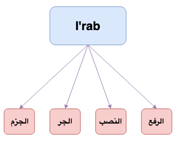

## What is I'rab in Arabic Grammar?
The word I'rab comes from أعرب يعرب أعرب الإعراب
- In لغة it means الإظهار و الإبانة i.e. when you want to show something
- Technically (اصطلاحاً) it means
 > تغييرُ أواخِرِ الكَلِمِ لاختِلافِ العوامِلِ الداخِلةِ عليها لفظاً أو تقديراً

## Visible Changes (لفظاً)
Let's take the example of زيدٌ,  
جاء زيدٌ  
رأيت زيداً  
ذهبت إلى زيدٍ  
We observe that the end of زيدٌ changes لفظاً when used with different words e.g. جاء, رأيت etc. The words جاء, رأيت are called عوامل  

## Invisible Changes (تقديراً)
Let's take the example of مصطفى,  
جاء مصطفى  
رأيت مصطفى  
ذهبت إلى مصطفى 

## Cases of I'rab (حالات الإعراب)
I'rab has four cases الرفع, النصب, الجر, الجزم. These cases can be found in الأسماء Or الأفعال.  

| Case  | Category        |
|-------|-----------------|
| الرفع | الأسماء الأفعال |
| النصب | الأسماء الأفعال |
| الجر  | الأسماء فقط     |
| الجزم | الأفعال فقط     |

 

{:title="4 Cases of I'rab"}

## علامات الإعراب
It can be divided into two categories

 

**علامات أصلية**  

| Case  | عَلامَة  |
|-------|--------|
| الرفع | الضمة  |
| النصب | الفتحة |
| الجر  | الكسرة |
| الجزم | السكون |

 

**علامات فرعية**  
- الواو  
- الألف  
- النون  
- الياء  
- الفتحة  
- الكسرة  

## Irab of Dual
**إعراب المثنى**{: .arabic}

In Dual nouns, it is mabe Raf with ا and made Nasb and Jar with ي.  
> يرفع المثنى بالألف ويُنصَب ويُجَرّ بالياء

Example
- جاء الرجل**ا**ن
- رأيت الرجل**ي**ن 
- ممرت بالرجل**ي**ن

## Irab of Masculine Unbroken Plural
**إعراب جمع المذكر السالم**{: .arabic}  

 
For Masculine Unbroken Plural, It is made Raf by و and Nasb, Jar by ي

> - يرفع      بالواو
- ينصب    بالياء
- يجر       بالياء

Example
- جاء المسلم**و**ن
- رأيت المسلم**ي**ن
- مررت بالمسلم**ي**ن

 

**I'rab of جاء المسلمون**

> **المسلمون**{: .arabic .irab}
فاعل مرفوع وعلامة رفعه الواو نيابة عن الضمة لأنه جمع مذكر سالم

 

It is also said that the ن is in place of Tanween in dual and plural form, its badl min tanween but not in every case. Basically its Ijtihad of Ulema

> النون عوض عن التنوين

 

Example
- Singular: جاء رجلٌ, Dual: جاء الرجلان
- Singular جاء مسلمٌ, Plural: جاء المسلمون

Also, ن of Masculine Unbroken Plural is with Fatha and ن of Dual is with Kasra
> نون جمع المذكر السالم مفتوحة او نون المثنى مكسورة

 

When Masculine Unbroken Plural and Dual is made idhafa its ن is dropped
> نون جمع المذكر السالم ونون المثنى تسقطان عند الإضافة

 

Example:  
**Plural**
- جاء مسلم**و** مكة
- رأيت مسلم**ي** مكة

 

**Dual**
- جاء طالب**ا** العلمِ
- رأيت طالبَ**ي** العلمِ

 

**Rules when made mudhaf with ي**
- هذان كتابان + ي becomes كِتاباي
- قرأت كِتَابَيْن + ي  becomes  كِتَابَيَّ
- جاء مُسْلِمُوْنَ + ي  
مُسْلِمُوْ + ي  
مُسْلِمِيْ + ي  
مُسْلِمِيّ  

## Irab of Feminine Unbroken Plural 
**إعراب جمع المؤنث السالم**{: .arabic}

 
Irab of Feminine Unbroken Plura is made Raf with Damma, Nasb and Jar with Kasra

> يرفع    بالضمة  
ينصب  بالكسرة  
يجر    بالكسرة  

 

Example:
- Raf: جاءت المسلما**تُ**
- Nasb: رأيت المسلما**تِ** 
- Jar: مررت بالمسلما**تِ**

 

**I'rab of رأيت المسلماتِ**

> **المسلمات**{: .arabic .irab}
مفعول به منصوب وعلامة نصبه الكسرة نيابة عن الفتحة لأنه جمع مؤنث سالم

## I'rab of Masculine broken Plural 
**إعراب جمع التكسير**{: .arabic}

They are called broken because they are not made exactly from the Singular form by adding وي.  
ِExample:
- رَجُل and رِجَال
- رَبْعٌ and  رُبُوع

 
I'rab of Masculine broken Plural is just like I'rab of singular i.e.

> يرفع    بالضمة  
ينصب   بالفتحة  
يجر     بالكسرة  

- Raf: جاء الرجا**لُ**
- Nasb: رأيت الرجا**لَ**
- Jar: مررت بالرجا**لِ**

 

**حالات الإعراب**{: .arabic}
- الرفع بالضمة
- النصب بالفتحة
- الجر بالكسرة
- الجزم بالسكون

 

**وخرج عن ذلك سبعة أبواب**{: .arabic}
- الأسماء الستة
- المثنى
- جمع المذكر السالم
- جمع المؤنث السالم
- الممنوع من الصرف
  - Here we use Damma for raf, fatha for nasb and kasra for Jar e.g. عرم، فاطمة
- الأفعال الخمسة
  - we use shubut nun for raf and hazf nun for Nasb and Jazm
- الفعل المضارع المعتل الآخر
  - Damma mukaddara e.g. يسعي Or يدعو
  - Jazm => Hazf harf Illa
  - Nasb => Fatha mukaddara for alif and fatha zahiara for و and ي

## Reference
[Qutoof Academy](https://www.qutoofacademy.com/){:target="_blank" rel="nofollow noopener"}