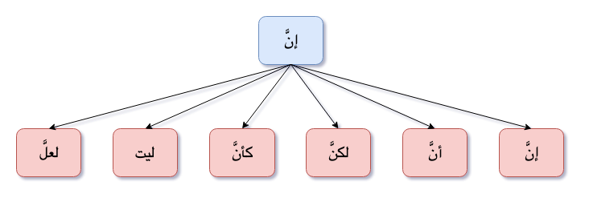

## what is Inna and its sisters? (إنّ و اخواتها)
<br/>

> **إن وأخواتها تنصب المبتدأ ويسمى اسم إن وترفع الخبر ويسمى خبر إن**

Example
إن الطالبَ مجتهدٌ


<br/>


|     | Usage     | Example           | Notes                                                     |
|-----|-----------|-------------------|-----------------------------------------------------------|
| إنَّ  | التأكيد   |                   |                                                           |
| أنَّ  | التأكيد   |                   |                                                           |
| لكنَّ | للاستدراك | زيد غني لكنه بخيل |                                                           |
| كأنَّ | للتشبيه    | زيد كالأسد        |                                                           |
| ليت | للتمني    | ليت الشبا بيعود   | When we hope for something impossible/very hard to happen |
| لعلَّ |     للترجي      | لعل الله يغفر لي  | To hope (علَّ = لعلَّ but we mostly use لعلَّ)                                                  |

<br/>

{:title="Inna and sisters"}

## When to use إن and when to use أن
**إن المكسورة تكون في**{: .heading1}  
- **أول الجملة**{: .heading2}
  - e.g. **إنا**{: .bg-yellow} أنزلناه في ليلة القدر
- **بعد القول**{: .heading2}
  - e.g. قال **إن**{: .bg-yellow}ي عبد الله
- **بعد الحلف (when we swear)**{: .heading2}
  - e.g. والله **إن**{: .bg-yellow}ي أحب الخير

<br/>

**أن المفتوحة تكون في**{: .heading1}  
- **In middle of sentence**{: .heading2}
  - e.g 
    - يعجبني أنك مجتهد 
    - أشهد **أن**{: .bg-yellow} محمداً رسول الله


<br/>

**قواعد:**   
أن المفتوحة can be used in a place where we can drop أن + Ism أن + Khabar أن + Replace it with Masdar.  
For example 
- يعجبني **أنك مجتهد**{: .bg-yellow} can be replaced with يعجبني **اجتهادُك**{: .bg-yellow}.  
- أشهد **أن محمداً رسول الله**{: .bg-yellow} can be converted to أشهد **برسالة محمد**{: .bg-yellow}

## Rules of Order
> **خبر إن لا يأتي قبل اسم إن إلا مع شبه الجملة**

- We can't change order in normal sentence i.e. for إن الطالبَ مجتهدٌ, We can't say <s>إن مجتهدٌ الطالبَ</s>
- But for Jar/Majroor and Dharf we can change order i.e. for إن طالباً في البيت we can say, إن في البيت طالباً
  - Quran Examples: 
    - إن في ذلك لأيةً
    - إن لدينا أنكالاً

## Rules of ما when used with إنّ
ما added with إنّ i.e. إنما is called ``` ما الكافة ``` and it stops the effect of إنّ.
> **ما الكافَّة تكف ( تمنع ) إن وأخواتها عن العمل**

<br/>

Similarly, ما can be used with rest of the sisters of إنّ

<br/>

Example: إن الطالبَ مجتهدٌ when used with ما becomes إنما الطالبُ مجتهدٌ

> **إن**{: .arabic .irab}
حرف ناسخ مبني

<br/>

> **ما**{: .arabic .irab}
الكافة حرف مبني

<br/>

> **الطالبُ**{: .arabic .irab}
مبتدأ مرفوع

<br/>

> **مجتهدٌ**{: .arabic .irab}
خبر مرفوع

<br/>

**قواعد:** 
- **إنّ** : تدخل على الجملة الاسمية فقط
- **إنما** : إنما تدخل على الجملة الاسمية و الفعلية

<br/>

Some Ulema says + الحريري,  
we can also say,  إنما الطال**بَ**{: .bg-yellow} مجتهدٌ (here ما is not ما الكافة  but ``` ما زائدة ``` )  
Most Ulema says above sentence is not correct but there is an exception with ليتما i.e. both of below are correct
  - ليتما الطال**بَ** مجتهدٌ
  - ليتما الطال**بُ** مجتهدٌ


<br/>

## Rules with اللام المزحلقة
When إن is used with اللام المزحلقة it slips to khabar e.g.  إن الطالب لمجتهد

> **إن**{: .arabic .irab}
حرف ناسخ مبني لا محل له من الإعراب

<br/>

> **الطالب**{: .arabic .irab}
 اسم إن منصوب

<br/>

> **اللام**{: .arabic .irab}
هي اللام المزحلقة حرف مبني لا محل له

<br/>

> **مجتهد**{: .arabic .irab}
خبر إن مرفوع

## Reference
[Qutoof Academy](https://www.qutoofacademy.com/){:target="_blank" rel="nofollow noopener"}