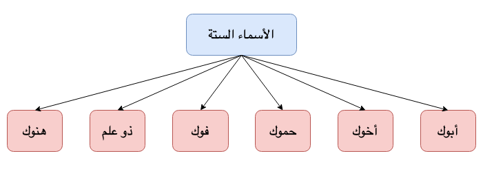

**Six Isms**{: .firstword} Or **الأسماء الستة**{: .firstword} are words in Arabic grammar having special conjugations in Raf, Nasb and Jar form.

 

Six Isms are as follows,
- أبوك
- أخوك
- حموك
- فوك
- ذو علم
- هنوك (A Thing)

 

{:title="Six Isms"}

## ما إعراب الأسماء الستة؟
- ترفع بالواو
- تنصب بالألف
- تجر بالياء

## ما شروط إعرابها؟
- **أن تكون مفردة**{: .heading1}
  - e.g. جاء أبوك
  - Can't say <s>جاء الأبوان</s> OR <s>جاء الآباءُ</s>
- **أن تكون مضافة**{: .heading1}
  - e.g. جاء أبو بكر
  - Can't say <s>جاء أبٌ</s>
- **أن تكون مضافة لغير ياء المتكلم**{: .heading1}
  - e.g. جاء أبو بكر OR جاء أبوك
  - Can't say <s>جاء أبي</s>
- **أن تكون مكبرة (i.e. it should not be diminutive form)**{: .heading1}
  - e.g. جاء أبو بكر OR جاء أبوك
  - Can't say <s>جاء أُبَيّ</s>

## Points to Remember
- We have two ways to say mouth e.g. فو and فم. Remember, فم is not الأسماء الستة
- We see in lot of books الاسماء الخمسة not الأسماء الستة because 
  - هنوك is not used a lot
  - Arabs used هنو with Damma, Fatha, Kasra not و ي ا 

## Reference
[Qutoof Academy](https://www.qutoofacademy.com/){:target="_blank" rel="nofollow noopener"}