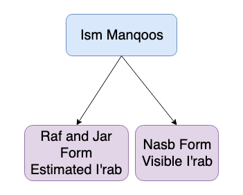

**Ism Manqoos**{: .firstword} Or **الاسم منقوص**{: .firstword} are those nouns which has ي at the end and before it is a Kasra.  
> كل اسم آخره ياء (خفيفة) قبلها كسرة (here خفيفة means no Shadda)

 

**Examples**
- **القاضِي** is Ism Manqoos
- **ظَبْي** is NOT Ism Manqoos because we have sukon before ي
- **مصرِيّ** is NOT Ism Manqoos because we have sukon before ي as **يْ ي**

## ما إعراب الاسم منقوص
Ism Manqoos are nouns in Arabic grammar having special declension/case in Raf, Nasb and Jar form. Rules of which are as follows:

### Thumb Rule in Ism Manqoos
- When Ism Manqoos is used in Raf and Jar form, its case ending is **estimated**.
- When Ism Manqoos is used in Nasb form, its case ending is **visible**.

> **تقدر**{: .bg-yellow} العلامة في حالة الرفع وحالة الجر و **تظهر**{: .bg-yellow} العلامة في حالة النصب

 

{:title="Ism Manqoos"}

 

**Without ال OR إضافة**
- **Raf**{: .heading1}: جاء    قا**ضٍ**
> **قاضٍ**{: .arabic .irab}
فاعل مرفوع وعلامة رفعه الضمة المقدرة

 

- **Nasb**{: .heading1}  رأيت  قاض**يًا**
> **قاضيًا**{: .arabic .irab}
مفعول به منصوب وعلامة نصبه الفتحة الظاهرة

 

- **Jar**{: .heading1} مررت  بقا**ضٍ**   
> **بقاضٍ**{: .arabic .irab}
اسم مجرور وعلامة جره الکسره المقدرة

 

**With ال OR إضافة**
- **Raf**{: .heading1}: جاء القاض**ي** OR جاء قاض**ي** المدينة
> **القاضي**{: .arabic .irab}
فاعل مرفوع وعلامة رفعه الضمة المقدرة

 

- **Nasb**{: .heading1}  رأيت القاض**يَ** OR رأيت قاض**يَ** المدينة
> **القاضيَ**{: .arabic .irab}
مفعول به منصوب وعلامة نصبه الفتحة الظاهرة

 

- **Jar**{: .heading1} مررت بالقاض**ي** OR مررت بقاض**ي** المدينة
> **القاضي**{: .arabic .irab}
اسم مجرور وعلامة جره الکسره المقدرة

## Reference
[Qutoof Academy](https://www.qutoofacademy.com/){:target="_blank" rel="nofollow noopener"}