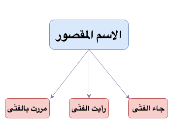

**Ism Maqsoor**{: .firstword} Or **الاسم المقصور**{: .firstword} are those nouns which has ى (Alif Maqsoor)  at the end and before it is a Fatha.

> كل اسم آخره ألف قبلها فتحة

 

**Examples**
- جاء الفتَ**ى**
- رأيت الفتَ**ى** 
- مررت بالفتَ**ى**

{:title="Ism Maqsoor"}

## ما إعراب الاسم المقصور
Maqsoor are nouns in Arabic grammar having special declension/case in Raf, Nasb and Jar form. 

 

They have no Alamat of I'rab i.e. we don't see damma, fatha or kasra on Ism Maqsoor but they are معرب and not مبنی.  
> الاسم المقصور لا تظهر عليه علامات الإعراب

## Reference
[Qutoof Academy](https://www.qutoofacademy.com/){:target="_blank" rel="nofollow noopener"}