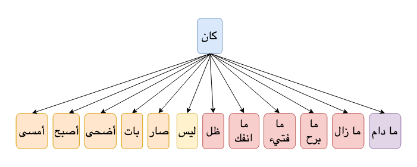

**Kana**{: .firstword} (كان) is a frequently used verb in Arabic Grammar. It has been widely used multiple places in Quran as well, for example
- وَمَا **كَانَ**{: .bg-yellow} اللَّـهُ لِيُعَذِّبَهُمْ وَأَنتَ فِيهِمْ ۚ وَمَا كَانَ اللَّـهُ مُعَذِّبَهُمْ وَهُمْ يَسْتَغْفِرُونَ in (سورة الأنفال: 33)
- وَمَا **كَانَ**{: .bg-yellow} اللَّـهُ لِيُضِلَّ قَوْمًا بَعْدَ إِذْ هَدَاهُمْ حَتَّىٰ يُبَيِّنَ لَهُم مَّا يَتَّقُونَ ۚ إِنَّ اللَّـهَ بِكُلِّ شَيْءٍ عَلِيمٌ in (سورة التوبة: 115) 

 

Sentence construction of kana and Sisters is simple but may get tricky when making sentence more eloquent. We will begin the discussion with a simple definition of kana and then we will try to drill down into few rules of kana and sisters.

So without further ado, lets make the concept of kana and its sisters Super Easy :) (إن شاء الله) 

## What is Kana and its sisters?
In Arabic Grammar, كان is an incomplete verb having two parts
- اسم كان (Ism Kana)
- خبر كان (Khabar Kana)

 

By incomplete we mean that كان has no doer but mention of time in the sentence. e.g. كان **الطالبُ**{: .bg-yellow} **مجتهداً**{: .bg-cyan} (The student was hardworking)  

 

Irab of  كان الطالبُ مجتهداً will be,

> **كان**{: .arabic .irab}
فعل ماض ناقص ناسخ

 

> **الطالب**{: .arabic .irab}
اسم كان

 

> **مجتهداً**{: .arabic .irab}
خبر كان

## Kana and Sisters Arabic Definition
> **كان وأخواتها أفعال ناسخة ترفع المبتدأ ويسمى اسم كان وتنصب الخبر ويسمى خبر كان**

 

There are 12 sisters of كان which are as follows:
- كان (to become)
- أمسى (to become)
- أصبح (to become)
- أضحى (to become)
- بات (to become)
- صار (to become)
- ليس (negation)
- ظل (to continue)
- ما انفك (to continue) 
- ما فتيء (to continue)
- ما برح (to continue)
- ما زال (to continue) 
- ما دام (as long as)

 

{:title="Kana And Its Sisters"}

### Type of ما used in sisters of Kana

We have seen above in 5 sisters of Kana we use ما, its characteristics are as follows,

- ما in all the sister of كان is ما نافية, except in case of دام
- In case of دام, the ما is ما مصدرية ظرفية i.e. we can replace ما دام with its مصدر
  - e.g.سأتعلم **ما دمت**{: .bg-yellow} حياً Or we can say سأتعلم **مدة دوامي**{: .bg-yellow} حياً

## Rules of preceding Khabar Kana w.r.t Ism Kana (ما حكم تقديم خبر كان على اسمها)
It is permissible to bring khabar of Kana before Ism of Kana. i.e.
> يجوز تقديم خبر كان على اسمها

 

Example: كان الطالبُ **مجتهداً** and كان **مجتهداً** الطالبُ both are correct.  
Examples from Quran:  وكان حقاً علينا نصرُ المؤمنين

 

 I'rab of **كان مجتهداً الطالبُ**
> **مجتهداً**{: .arabic .irab}
خبر كان مقدم

 

> **الطالب**{: .arabic .irab}
اسم كان مؤخر

 

I'rab of **وكان حقاً علينا نصرُ المؤمنين**

> **حقاً**{: .arabic .irab}
خبر كان مقدم

 

> **نصر**{: .arabic .irab}
اسم كان مؤخر

## Rules of preceding Khabar Kana w.r.t Kana and Ism Kana (ما حكم تقديم خبر كان على كان واسمها)
It is permissible to bring khabar of Kana even before Kana and its Ism. i.e.
> يجوز تقديم خبر كان على كان و اسمها

 

Example: كان الطالبُ **مجتهداً** and **مجتهداً** كان الطالبُ both are correct.

Exception:
{: .exception}
- لا يجوز تقديم خبر ليس على ليس i.e. <s> البرَّ ليس أن تأتوا </s>
- لا يجوز تقديم خبر على هذه الأفعال
  - ما انفك  
  - ما فتيء 
  - ما برح
  - ما زال

## Types of Kana (كان)
Lets discuss what is فعل تام and فعل ناقص before covering the types of Kana.  
**فعل تام**  
Example: كتب الطالبُ الدرس  
- It has حدث (doer or فاعل) i.e. someone is holding pen and writing
- It has زمن (time) implying it happened in the past

 

**فعل ناقص**  
Example: كان الطالبُ مجتهداً
- No حدث (i.e. no فاعل)
- It has only زمن

Here we ony have اسم كان و خبر كان  

 

Similarly كان is also divided into two groups, كان ناقص and كان التامة 
- **كان التامة** having حدث and زمن
- **كان ناقص** having only زمن

Example:  
- **وإن كان ذو عسرة** (And if someone is in hardship)  
This كان has حدث
> **كان**{: .arabic .irab}
فعل تام
> **ذو**{: .arabic .irab}
فاعل مرفوع

 

- **خالدين فيها مادامت السموات والأرض** 
> **السموات**{: .arabic .irab}
فاعل مرفوع

 

- **كن فيكون** (Be So it will happen)  
> **كن**{: .arabic .irab}
فعل ناقص
> **يكون**{: .arabic .irab}
فعل تام

 

- **أصبحنا وأصبح الملك لله** (We entered the time of morning and the universe is owned by Allah)  
> **أصبح**{: .arabic .irab}
فعل ناقص  
> **أصبحنا**{: .arabic .irab}
فعل تام  
> **نا**{: .arabic .irab}
ضمير مبني في محل رفع فاعل  

 

-  **أمسينا وأمسى الملك لله** (We entered the time of evening and the universe is owned by Allah)
> **أمسينا**
فعل تام  
> **أمسى**
فعل ناقص  
> **نا**{: .arabic .irab}
ضمير مبني في محل رفع فاعل  

 

-  **فسبحان الله حين تمسون وحين تصبحون** (So Glory be to Allah when we enter time of evening and time of morning)   
> **تمسون**{: .arabic .irab}
فعل تام  
> **تصبحون**{: .arabic .irab}
فعل تام

## Extra/Additional ب appearing in Kana and Sister
- The extra/Additional ب used in Kana and Sister is called الباء زائدة.
- It comes in sentences having ليس and is added to khabar of ليس
  > تأتي الباء زائدة مع خبر ليس
- We use الباء زائدة for توكيد. Example,
  -  ليس الطالبُ **ب**{: .bg-yellow}المجتهدِ
  > **المجتهد**{: .arabic .irab}
خبر ليس منصوب وعلامة نصبه الفتحة المقدرة  
أو  
مجرور لفظاً منصوب محلاً  
  - Quranic Examples:
    - أليس الله **ب**{: .bg-yellow}كاف عبده
    - لست عليهم **ب**{: .bg-yellow}مسيطر

## Reference(s) used in Kana and Sister 
- [Qutoof Academy](https://www.qutoofacademy.com/){:target="_blank" rel="nofollow noopener"}
- [tanzil.net](http://tanzil.net/){:target="_blank" rel="nofollow noopener"}