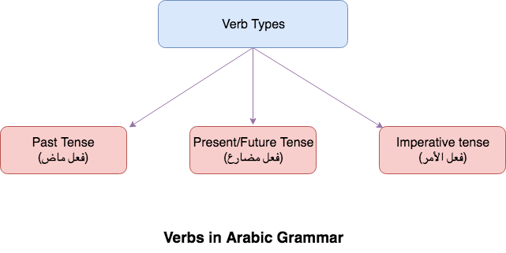

## What are Verbs in Arabic Grammar?
Verbs in Arabic Grammar represents *an Action*. It basically informs us about two properties
- Doer of Action (فاعل or حدث)
- Time when that Action took place (زمن)

## What are Kinds Verbs in Arabic Grammar?
There are three kinds of verbs in Arabic Grammar,
- **فعل ماض** It represents Past Tense
- **فعل مضارع** It represents Present and Future Tense
- **فعل أمر** It is Imperative i.e. commanding verb

{:title="verbs-in-arabic-grammar"}

 

We will learn Arabic Verbs briefly and will try to make **Arabic verb easy** (إن شاء الله)  
Lets begin with first kind

## Past Tense Verb in Arabic Grammar (فعل ماض)
This verb represents an action that took place in the past. 

 

**Arabic Past tense Verb examples**  
- ذهب زيد (Zaid went)
- دخل زيد (Zaid entered)

 

**Basic Arabic Verb Conjugation Chart/Table in Past tense**  
*Verb Table*

|                        | Singular | Dual   | Plural  |
|------------------------|----------|--------|---------|
| Third Person (Male)    | كَتَبَ      | كَتَبَا   | كَتَبُوا   |
| Third Person (Female)  | كَتَبَتْ     | كَتَبَتَا  | كَتَبْنَ    |
| Second Person (Male)   | كَتَبْتَ     | كَتَبْتُمَا | كَتَبْتُمْ   |
| Second Person (Female) | كَتَبْتِ     | كَتَبْتُمَا | كَتَبْتُنَّ   |
| First Person           | كَتَبْتُ     |        | كَتَبْنَا   |

### How to identify past tense Verb in Arabic Grammar (ما علامة فعل ماض) 
**Use of أمسِ**{: .heading1}
- For example: ذهبتُ أمسِ
- This is not a very good علامة because 
  - It can be used in فعل مضارع also e.g. لم يذهب زيد إلى البيت **أمسِ**
  - At times it can't be used in فعل ماض e.g. إن حضر زيد أكرمته

### Rules of past tense Verb in Arabic Grammar (الحكم الفعل الماضي)
There are 3 states in which فعل ماض exists,
- فعل ماض having Fatha in the end (يبنى الفعل الماضي على الفتح)
  - This is the default case of فعل ماض
  - Example: كت**بَ** الطالب الدرس
- فعل ماض having Damma in the end (يبنى الفعل الماضي على الضم)
  - This state comes with واو الجماعة in the end. e.g. الطلاب كت**بُ**وا الدرس
- فعل ماض having Sukoon in the end
  - This state comes with ضمير رفع متحرك
  - Side Note ضمير رفع متحرك comes with
    - تاء الفاعل e.g. كت**بْ**تُ الدرس 
    - نا الفاعلين e.g. كت**بْ**نَا الدرس 
    - نون النسوة e.g. الطالبات كت**بْ**نَ الدرس

## Present/Future Tense Verb in Arabic Grammar (فعل مضارع)
فعل مضارع is used to express an action in present or an action that will happen in the future.  

 

**Arabic Past tense Verb examples**  
- يَدْخُل (He enters)
- يكتب (He writes)

 

**Basic Arabic Verb Conjugation Chart/Table in Present tense**  
*Verb Table*

|                        | Singular | Dual   | Plural  |
|------------------------|----------|--------|---------|
| Third Person (Male)    | يَكْتُبُ     | يَكْتُبَانِ | يَكْتُبُونَ  |
| Third Person (Female)  | تَكْتُبُ     | تَكْتُبَانِ | يَكْتُبْنَ   |
| Second Person (Male)   | تَكْتُبُ     | تَكْتُبَانِ | تَكْتُبُونَ  |
| Second Person (Female) | تَكْتُبِينَ   | تَكْتُبَانِ | تَكْتُبْنَ   |
| First Person           | أَكْتُبُ     |        | نَكْتُبُ    |

### How to identify present tense Verb in Arabic Grammar (ما علامة فعل مضارع) 
- فعل مضارع **Always** begins with words ن – أ - ي - ت which is also called as **أحرف المضارعة** which is put in one word نأيت.
- One point to note is these are *NOT 100% sure علامات* of فعل مضارع because there are nouns also that begin with ن – أ - ي - ت.

### Rules of present tense Verb in Arabic Grammar (الحكم الفعل مضارع)
- **فعل مضارع is معرب**{: .heading1}  
*Exceptions*{: .exception}
  - When added نون التوكيد e.g. لأكتبَنَّ
  > **لأكتبَنَّ**: فعل مضارع مبني على الفتح
  - When we have نون النسوة e.g. النساء يكتبْن الدرس
  > **يكتبْن**: فعل مضارع مبني على السكون

 

- فعل مضارع is مفتوحاً when فعل ماض is ثلاثياً OR خماسياً OR سداسياً but it is مضموماً when فعل ماض is رباعياً e.g. (زلزل, يُزلزل). 
  - It has to be 4 letters either with فعل مجرّد e.g. (وسوس, يُوسوس) or فعل مزيد e.g. (اقام ,يُقيم)

  | Verb          | Letters |
|---------------|---------|
|    ذهب يَذهب   |    3    |
|    جاء يَجيء   |    3    |
| التجى يَلتجي   | 5       |
| استجاش يَستجيش |    6    |

## Imperative tense Verb in Arabic Grammar (فعل الأمر)
- Imperative verb represents a command
- Imperative verb is made from present tense by making it makzoom and dropping the أحرف المضارعة which is (ن – أ - ي - ت) from it (فعل الأمر يُبْنَى على ما يُجْزَم به مضارعٌه)
  - Example: يكتبُ is present tense and اكتبْ is فعل الأمر by dropping ي and adding Sukoon in the end.

 

**Arabic Imperative tense Verb examples**  
- اكتبْ دَرسك (Write your lesson)
- اخرج من البيت (Get out of the house)

 

**Basic Arabic Verb Conjugation Chart/Table in Imperative tense**  
*Verb Table*

|                        | Singular | Dual  | Plural |
|------------------------|----------|-------|--------|
| Second Person (Male)   | اكتب     | اكتبا | اكتبو  |
| Second Person (Female) | اكتبي    | اكتبا | اكتبن  |

### Rules of Imperative Verb in Arabic Grammar (الحكم الفعل الأمر)
- Fixed on Sukoon (مبني على السكون)
  - Example: اكتبْ دَرسك
- Fixed on dropped Noon (مبني على حذف النون)
  - When الفعل المضارع is from the الأفعال الخمسة i.e. يكتبان تكتبان يكتبون تكتبون تكتبين then فعل الأمر will be
    - اكتبا الدرس
    - اكتبوا الدرس
    - اكتبي الدرس
- Fixed on dropped Weak letter (مبني على حذف حرف العلة)
  - When الفعل المضارع has Weak letter (حرف العلة) at the end of the verb e.g. يسعى OR يقضي OR يدعو then فعل الأمر will be
    - اسعَ
    - اقضِ
    - ادعُ

### Special situations in فعل الأمر
- Meeting of two sakins (الالتقاء ساكنين)
  - In Arabic language two sakin words can't come together. So to mitigate this situation we add Kasra at the end of فعل الأمر e.g. اكت**بِ** **الْ**درس
- فعل الأمر from فعل اجوف
  - E.g. خاف  يخاف Amr (الأمر) will be خفْ 
  - E.g. أجاد يجيد Amr (الأمر) will be أجدْ

 

Verbs in Arabic grammar at first glance looks quite complex and overwhelming with their conjugation rules. You may follow the following simple guidelines to nail verbs in Arabic grammar,
- Start with learning simple verbs like ضرب، فتح etc
- Whenever you see a new verb write it down and conjugate it at least once.
- Conjugate 2 verbs every day **NO MORE NO LESS**
- Learn different forms of verb slowly once you are comfortable with basic form
- Learn verbs with weak letters i.e. ا ي و in the end one you are comfortable with all the forms of verb
- Make a lot of Dua (And remember me in them as well :) )
- Give yourself time and إن شاء الله you will slowly grasp verbs in Arabic Grammar

## Verbs in Arabic Grammar Reference(s)
- [Qutoof Academy](https://www.qutoofacademy.com/){:target="_blank" rel="nofollow noopener"}
- [cooljugator.com](https://cooljugator.com/ar/%D9%83%D8%AA%D8%A8){:target="_blank" rel="nofollow noopener"}
- [acon.baykal.be](http://acon.baykal.be/index.php?r3=%D8%A8&r2=%D8%AA&r1=%D9%83&type=I&pvowel=a&ivowel=u&display=traditional){:target="_blank" rel="nofollow noopener"}
