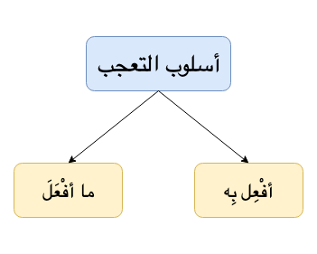

**Exclamations**{: .firstword} means to express surprise, strong emotion etc. Naturally, we as student of Arabic grammar would love to know
- ``` How to express excitement in Arabic ```
- ``` What are expression of exasperation in Arabic ```
- ``` What is an arabic expression of surprise ```

<br/>

May be ``` Arabic expression of OMG (oh my god) ```

and other similar questions...

<br/>

Arabic being a vast and diverse language has a concept of ``` Ta'jjub (تعجُّب)``` to express similar emotions. We can also see the use of التعجب in Quran,
-  أَبْصِرْ بِهِ وَأَسْمِعْ (Quran 18:26) (How Amazingly well He (Allah) Sees and how Amazingly well He (Allah) can Hear !!)

<br/>

So without further ado lets discuss exclamations in Arabic Grammar and make it super easy (إن شاء الله)

## How exclamations in Arabic work?

There are certain expressions in Arabic language which we can use to express emotions of excitement like how beautiful, how amazing etc. These expressions describe strong feelings in Arabic language.  

<br/>

**Excited to drill down??**  
<br/>

Let's make the concept of التعجب super easy in Arabic language.  

First things first, lets understand the word التعجب. It is a مصدر (masdar) from word  

``` تعجَّب  يتَعَجَّب  تعجبْ  التَّعَجُّب ```   
meaning to be amazed or astonished (when we see something amazing or rare)

<br/>

In Arabic, we can express تعَجُّب in many ways e.g.
- By saying Subhan Allah سبحان الله
- By saying Alhamdu lillah الحمد لله

But exclamations in Arabic (تعَجُّب) can also be expressed using certain styles offered by Arabic language. Which we will discuss below

## Style of exclamations in Arabic
**أسلوب التعجب**{: .arabic}

<br/>

There are 2 styles of expressing تعَجُّب or exclamations in Arabic language,
- ما أفْعَلَ
- أفْعِل بِه

{:title="Exclamations in Arabic"}

### ما أفْعَلَ
The sentence made from above expression is a Nominal Sentence or ``` جملة اسمية ```. For example to say
- ما أعظمَ العلمَ (Nothing is greater than knowledge)
  - which is equal to say, شيء عظيم جعل العلمَ عظيماً
- ما أجمل الليلة (what a beautiful night)
- Quranic Examples: ما أصبرهم على النار

<br/>

**Irab of ما أعظمَ العلمَ**
> **ما**{: .arabic .irab}
اسم تعجب مبني على السكون في محل رفع مبتدأ

<br/>

> **أعظم**{: .arabic .irab}
فعل ماض مبني على الفتح والفاعل ضمير مستتر تقديره هو

<br/>

> **العلمَ**{: .arabic .irab}
مفعول به منصوب

<br/>

> **أعظمَ العلمَ**{: .arabic .irab}
الجملة الفعلية في محل رفع خبر

### أفْعِل بِه
The sentence made from above expression is a Verbal Sentence or ``` جملة فعلية ```. For example to say
- أعظِمْ بالعلمِ (Nothing is greater than knowledge)
- أجمل بالليلة (what a beautiful night)
- Quranic Example: أسمِع بهم وأبصر

<br/>

**Irab of أعظِمْ بالعلمِ**

> **أعظِم**{: .arabic .irab}
فعل ماض جاء على صيغة الأمر

<br/>

> **الباء**{: .arabic .irab}
حرف جر زائد

<br/>

> **العلم**{: .arabic .irab}
فاعل مرفوع وعلامة رفعه الضمة المقدرة

## Rules of Exclamations in Arabic  
**شروط فعل التعجب**{: .arabic}

1. Arabic Verb should be three lettered i.e فعل ثلاثي
    - For example, we can't make التعجب from استغفر. But we can say, ما **أعظمَ**{: .bg-cyan} **استغفارَ**{: .bg-yellow} المؤمن where استغفارَ is مصدر of استغفر
2. It has to be مُتَصَرِّف i.e. should have ماض, مضارع etc
    - For example, we can't use ليس Or نعم OR بئس
3. We **can't** use verb with negation i.e. it has to be مُثبَت
4. It has to be capable of comparison i.e. قابِل للمُفاضلة. To understand this lets take an example
    - When we say ما أجمل الليلة we mean there is beauty in this night and there is beauty in other nights but beauty of this night is more
    - But with مات, it doesn't have مفاضلة i.e. there no difference between one death or the another one so it is غيرُ قابل للمفاضلة. But we can say, 
    - ما أقسى **موتَ**{: .bg-yellow } زيدِ (How cruel/harsh is death of Zaid)
5. It **can't** be a verb which can be used in أفعل فعلاء form. E.g. أبيض بيضاء OR أعمى عمياء. But we can say,
    - ما أشد **بياضَ**{: .bg-yellow } الثوب
    - ما أشد **عَمَى**{: .bg-yellow } الكافر
    - ما أنقى **بياض**{: .bg-yellow} الثوب

<br/>

That's all folks !!  
Thats pretty neat summary of how exclamations in Arabic work.

<br/>

But like I see you people are utmost sincere and patient.Remember, **Allah is with the patient** ``` ان الله مع الصابرين ``` (Ref 2:153). I would like to cover two more emotions viz,
- **الإغراء**
- **التحذير**

## الإغراء
الإغراء comes from the word  

``` أغرى  يغري  أغر  الإغراء ```   

meaning **to advice** or **encourage** for something or **to incite/instigate** to do something i.e. 
> أن أنصحك بشيء جيد لتلزمه أو لتفعله

<br/>

To express الإغراء we repeat the same word making it منصوب. For example,
- الصلاةَ الصلاةَ meaning ``` Do not leave Salah OR Take care of Salah```  
  - We can also say ``` الزم الصلاةَ ``` to express the same meaning.
- الدراسةَ الدراسةَ meaning ``` Encouragement to study ```

<br/>

**Irab of الصلاةَ الصلاةَ**
> **الصلاةَ**{: .arabic .irab}
مفعول به منصوب لفعل محذوف تقديره الزم
او
منصوب على الإغراء

## التحذير 
التحذير comes form the word  

``` حذر يحذر التحذير ```  
i.e. to Warn and is opposite to **الإغراء**

<br/>

To express التحذير we repeat the same word making it منصوب. For example,
- اللهَ اللهَ meaning ``` Warning to the anger of Allah ```   
  - We can also say ``` احذروا غضب الله ``` to express the same meaning.
- الفشلَ الفشلَ meaning ``` Warning of failure ```

<br/>

**Irab of اللهَ اللهَ**
> **الله**{: .arabic .irab}
مفعول به منصوب لفعل محذوف تقديره اِحذَر
او
منصوب على التحذير

<br/>

That's pretty much it people. Now you have a good overview of how to be amazed like an Arab, OR Warn like an Arab or to encourage like an Arab. And if any one asks you why you are making sentences like this, proudly say the phrase   
**Because Arab said so !!!**

<br/>

haha, Jokes apart. That how exclamations in Arabic Grammar works

## Exclamations in Arabic Reference(s)
- [Qutoof Academy](https://www.qutoofacademy.com/){:target="_blank" rel="nofollow noopener"}