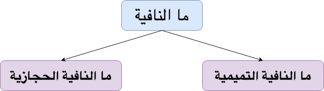

**Negation**{: .firstword} in any language is very common and so in Arabic language. There are multiple ways to negate a sentence in Arabic language and one among them is to use ما at the beginning of sentence.  
Again Arabic being a colorful language comes with a colorful set of rules when we use ما to negate a sentence. So without further Ado lets begin and learn its rules (إن شاء الله)

## Types of Negation with ما
 **أَقْسام ما النافية**{: .arabic}

There are two types of ما النافية in Arabic Grammar  

 

{:title="Types of ما النافية"}

### ما النافية الحجازية
Characteristics of ما النافية الحجازية are as follows
- This ما is used by tribes of Hijaz e.g. Makkah
- This ما is like ليس in the meaning and also in the function in the sentence.
- This ما affects the sentence after it i.e. it تعمل 
- Example: ما زيدٌ **مجتهداً**{: .bg-yellow}  

 

**Irab of ما زيدٌ مجتهداً**
  > **ما**{: .arabic .irab}
  ما الحجازية حرف نفي مبني لا محل له من الإعراب  

 

  > **زيد**{: .arabic .irab}
  اسم ما الحجازية مرفوع

 

  > **مجتهداً**{: .arabic .irab}
  خبر ما الحجازية منصوب

### ما النافية التميمية
Characteristics of ما النافية التميمية are as follows
  - This ما is used by tribes of Bani Tamim
  - This ما doesn't affect the sentence after it i.e. لا تعمل
  - Example: ما زيدٌ **مجتهدٌ**{: .bg-yellow}

 

**Irab of ما زيدٌ مجتهدٌ**
  > **ما**{: .arabic .irab}
  ما التميمية حرف نفي مبني لا محل له من الإعراب  

 

  > **زيد**
  مبتدأ مرفوع

 

  > **مجتهداً**
  خبر مرفوع

 

Quran came down in language of Hijaz i.e. in the language of people of Makkah. So we often find negation with ما النافية الحجازية  

 

**Quran Examples:**
- ما هذا بشر**اً** (Ref: 12:31)
  - > **ما**{: .arabic .irab}
    ما الحجازية حرف نفي مبني لا محل له من الإعراب
- ما هن أمها**تِ**هم (Ref: 3:144)

 

One fine point to remember is When we use إلا with ما it doesn't affect the sentence.  
Example و**ما** محمدٌ **إلا** رسولٌ (Ref: 59:2)

## Reference
- [Qutoof Academy](https://www.qutoofacademy.com/){:target="_blank" rel="nofollow noopener"}