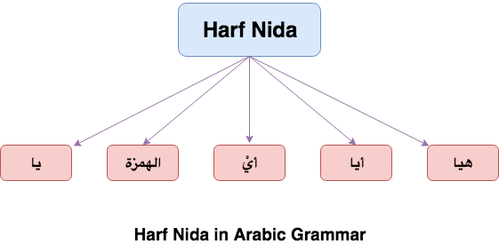

**Harf Nida**{: .firstword} Or Vocative Particle in Arabic helps us to gain the attention of a person by calling/addressing him. This concept is heavily used in Quran in multiple places, viz
- ``` يَا آدَمُ اسْكُنْ أَنتَ وَزَوْجُكَ الْجَنَّةَ ``` (Ref 2:35)
- ``` يَا بَنِي إِسْرَائِيلَ اذْكُرُوا نِعْمَتِيَ الَّتِي أَنْعَمْتُ عَلَيْكُمْ ``` (Ref 2:40)
- ``` يَا أَيُّهَا النَّاسُ اعْبُدُوا رَبَّكُمُ الَّذِي خَلَقَكُمْ وَالَّذِينَ مِن قَبْلِكُمْ لَعَلَّكُمْ تَتَّقُونَ ``` (Ref 2:21)

<br/>

So without further ado, lets begin the discussion with the definition of harf النِّداء itself. It is a مصدر (masdar) from word  

``` نادى  ينادي  ناد  النِّداء ```  
meaning to call, appeal etc

## Types of Harf Nida 
There are 5 types of Harf nida 

1. **Harf يا**{: .heading1}
    - This letter is called Ummul Bab (ام الباب)
    - We use this letter to call someone **Near us OR Far away**{: .bg-yellow} from us (ننادي بها القريب والبعيد)
    - Example: ``` يا زيدُ ```

2. **Harf الهمزة**{: .heading1}
    - We use this letter to call someone **Near us**{: .bg-yellow} (ننادي بها القريب)
    - Example: ``` أزيدُ ```

3. **Harf أيْ**{: .heading1}
    - We use this letter to call someone **in between i.e. neither far nor close**{: .bg-yellow} (ننادي بها المتوسط)
    - Example: ``` أيْ زيدُ ```

4. **Harf أيا**{: .heading1}
    - We use this letter to call someone **Far away**{: .bg-yellow} from us (ننادي بها البعيد)
    - Example: ``` أيا زيدُ ```

5. **Harf هيا**{: .heading1}
    - We use this letter to call someone **Far away**{: .bg-yellow} from us (ننادي بها البعيد)
    - Example: ``` هيا زيدُ ```

**Note:** There is Khilaf regarding above rules but above are general guidelines.  
{:title="Harf Nida"}

<br/>

**Point to Consider**  
- When we say, ``` يا زيد ``` it is similar in saying, ``` أنادي زيداً ```
- When we say someone is near (القريب) then he may be
  - Near us physically
  - Near us metaphorically (i.e. we are talking about someone far away from us but we feel that He is with us)
- Similarly for البعيد (far away), someone may be close to us but we feel He is not with us OR We feel he is very high in rank/position.

## Cases of المنادى in Harf Nida
**حالات النداء**{: .arabic}

There are 5 situations of المنادى when used with Harf Nida,

1. **الحالة الأولى**{: .heading1}
    - المنادى **علمٌ مفرد**{: .bg-yellow}
    - علمٌ means name of person, country, city etc and مفردٌ means not مضاف and شبيه بالمضاف.
    - This type has damma on the منادى and is estimated in Nasb form. ``` يبنى على الضم في محل نصب ```
    - Example: يا **زيدُ**{: .bg-yellow}. Here زيدُ is مفردٌ  
      **Irab of يا زيدُ**{: .heading2}
      > **زيد**{: .arabic .irab}
    منادى مبني على الضم في محل نصب

2. **الحالة الثانية**{: .heading1}
    - المنادى **نكرة مقصودة**{: .bg-yellow}
    - By نكرة مقصودة we mean even though the person addressed is نكرة (Indefinite) but still we are talking to a specific person. 
    - Example: يا **رجلُ ساعدني**{: .bg-yellow} (O Man, Help me). Here we are not calling any man but to a specific man that we are seeing now for help
    - It is made Raf as per situation e.g. Damma, Alif (for dual) etc and is estimated in Nasb form. ``` يبنى على ما يرفع به في محل نصب ```
      - Example: يا رجل**ا**ن, here its Raf on Alif ``` منادى مبني على الألف ```
      - Example: يا مسلم**و**ن, here its Raf on Waw ``` منادى مبني على الواو ```

3. **الحالة الثالثة**{: .heading1}
    - المنادى **نكرة غير مقصودة**{: .bg-yellow}
    - By نكرة غير مقصودة, we mean we are talking in general
    - Example: يا **عاصياً**{: .bg-yellow} تبْ إلى الله (O Sinner, Repent to Allah)
    - This type has منادى in Nasb form i.e. يُنصَب  
    **Irab of يا عاصياً تُبْ إلى الله**{: .heading2}
    > **عاصياً**{: .arabic .irab}
    منادى **منصوب**{: .irabhighlight} وعلامة نصبه الفتحة

4. **الحالة الرابعة**{: .heading1}
    - المنادى **مضاف**{: .bg-yellow}
    - This type has منادى in Nasb form i.e. يُنصَب
    - Example: يا **طالبَ العلمِ**{: .bg-yellow} اجتهد  
    **Irab of يا طالبَ العلمِ اجتهد**{: .heading2} 
    > **طالب**{: .arabic .irab}
    منادى **منصوب**{: .irabhighlight} وعلامة نصبه الفتحة وهو مضاف

5. **الحالة الخامسة**{: .heading1}
    - المنادى **شبيه بالمضاف**{: .bg-yellow}
    - This type has منادى in Nasb form i.e. يُنصَب
    - Example: يا **طالباً للعلم**{: .bg-yellow} اجتهد
      - The above example is technically not مضاف but the meaning of ``` طالباً للعلم ``` is similar to ``` طالبَ العلمِ ```. Hence, we call it ``` شبيه بالمضاف ``` Or Similar to مُضاف  
    **Irab of يا طالباً للعلم اجتهد**{: .heading2}
    > **طالباً**{: .arabic .irab}
    منادى **منصوب**{: .irabhighlight} وعلامة نصبه الفتحة

<br/>

{:title="Cases for Munada"}

## Rules of Harf Nida with ال

Arabic being a fantastic language and Arabs being wonderful, experimental people felt that we need to decorate the rules of Harf Nida. So they came up with a strategy with the use of Harf Nida with ال, which goes as follows:
- We can't use harf Nida with a word starting with ال. Basically we can't say, <s>يا الرجل</s>. But they have an **Exception**{: .exception} to this rule with لفظ جلاله **الله**, i.e we can say, يا اللهُ (See how amazing). But usually they make Nida to Allah by saying, **اللهُمَّ**  
> (الكلمة التي تبدأ ب ( ال ) لا يستخدم العرب معها حرف النداء مباشرة ويستخدمون ( أيها  ) و ( أيتها  
> (وهناك استثناء ل (لفظ الجلالة 

<br/>

**Irab of اللهُمَّ**{: .heading1}
> **الله**
لفظ الجلالة منادى مبني على الضم في محل نصب

> **الميم**
عوض عن حرف النداء المحذوف وهو حرف مبني على الفتح لا محل له

<br/>

- To make Nida for word starting with ال e.g. الرجل, المرأة
  - For male, we insert **أيها** in the middle e.g. يا **أيها**{: .bg-yellow} الرجل. 
  - For female, we insert the word **أيتها** in the middle e.g. يا **أيتها**{: .bg-yellow} المرأة

<br/>

**Irab of يا أيها الرجل**{: .heading1}
> **يا**{: .arabic .irab}
حرف نداء مبني لا محل له

<br/>

> **أيُ**{: .arabic .irab}
**منادى**{: .irabhighlight} مبني على الضم في محل نصب

<br/>

> **ها**{: .arabic .irab}
حرف تنبيه مبني لا محل له

<br/>

> **الرجل**{: .arabic .irab}
بدل مرفوع بالضمة

<br/>

**Irab of يا أيها الذين آمنوا**{: .heading1}
> **يا**{: .arabic .irab}
حرف نداء مبني لا محل له

<br/>

> **أيُ**{: .arabic .irab}
**منادى**{: .irabhighlight} مبني على الضم في محل نصب

<br/>

> **ها**{: .arabic .irab}
حرف تنبيه مبني لا محل له

<br/>

> **الذين**{: .arabic .irab}
اسم موصول مبني في محل رفع بدل

## Rules of Harf Nida when its Mudhaf with ي
**إذا كان المنادى مضافاً لياء المتكلم**{: .arabic}

<br/>

Arabs being intelligent race further decorated the rules of Harf Nida when its Mudhaf with ي. So they said, Even though we have a perfect sentence like,  
يا **صديقيْ**{: .bg-yellow} أقبل (O My friend Come here !!)  

<br/>

We can have the same sentence in multiple forms which are listed below,

- يا **صديقيْ**{: .bg-yellow} أقبل
  - ياء المتكلم ساكنة

- يا **صديقيَ**{: .bg-yellow} أقبل
  - ياء المتكلم مفتوحة

- يا **صديقيَهْ**{: .bg-yellow} أقبل
  - ياء المتكلم مفتوحة مع هاء السكت

- يا **صديقَا**{: .bg-yellow} أقبل
  - ياء المتكلم قُلِبَتْ ألفاً

- يا **صديقِ**{: .bg-yellow}
  - حذفت ياء المتكلم وبقيت الكسرة
  > **الياء المحذوفة**{: .arabic .irab}
  ضمير مبني في محل جر مضاف إليه

- يا **صديقُ**{: .bg-yellow}
  - حذفت ياء المتكلم وضمَّ ما قبله 

## Rules of Harf Nida with أب Or أم

Arabs being wonderful people allowed to use ت in place of ياء المتكلم in case of أب Or أم i.e. we can say **يا أبتِ** OR **يا أبتَ** in place if **يا أبي**
> مع كلمة ( أب ) و ( أم ) يجوز أيضاً استخدام التاء

## Dropping Harf Nida
It is permissible to drop Harf Nida when Nida is made
  - Example: ``` ربِّ استجب دعائي ``` is equal to ``` يا ربِّ استجب دعائي ```
  - Quranic Example: ``` يوسفُ أعرض عن هذا ``` (Ref: 12:29), is equal to saying ``` يا يوسفُ أعرض عن هذا
 ```
  - **Exception**{: .exception} The above rule has an exception with اسم إشارة i.e. we can't say <s>هذا أقبل</s> in place of ``` يا هذا أقبل ```.  
  **Pls Note**: Some Ulema says, It is permissible to say ``` هذا أقبل ``` (Khilaf). So I rest my case there people and its upto you which opinion you follow. :)
  > إلا إذا كان المنادى اسم إشارة فلا يجوز حذف حرف النداء.

<br/>

Before concluding I would like to cover one more topic which involves use of Harf Nida and that is ...

## Tarkheem
**الترخيم**{: .arabic}

Tarkheem comes from the word  

``` رخَّم  يرخِّم الترخيم ```  
means to make your voice soft or sweet.

<br/>

In nahw, it means to drop the last letter or last two letters.  

``` حذف آخر (حرف أو حرفين) من الاسم في النداء ```

<br/>

Tarkheem usually occurs in case of Nida but sometimes we use this in other place as well.  
For example: ``` يا عائشَةُ ``` with Tarkheem becomes ``` يا عائشُ ``` (we have dropped ة i.e last letter)

**Irab of يا عائشُ**{: .heading1}
> **عائشُ**{: .arabic .irab}
منادى مبني على الضم على التاء المحذوفة للترخيم في محل نصب

<br/>

**But the question arises why we do so?**  
*Short Answer*, When we like/love someone we use this as a nickname.

<br/>

### Observation
One thing to notice is when we dropped ة from عائشَةُ we changed the haraka above ش from from  َ  (fatha) to   ُ (damma).  

<br/>

We can also make tarkheem from عائشَةُ without changing the haraka over ش.  
Example: ``` يا عائشَةُ ``` with Tarkheem becomes ``` يا عائشَ ```  

**Irab of يا عائشَ**{: .heading1}
> **عائشَ**{: .arabic .irab}
منادى مبني على الفتح على التاء المحذوفة للترخيم في محل نصب

<br/>

In case of يا عائشَ, since the harakah has not changed we (as listner) will wait for the speaker to complete the word i.e. we are waiting for the ة to come. This expression is called ``` لغة من ينتظر ``` i.e. language which is waiting. 

<br/>

But in case of ``` يا عائشُ ``` we have changed the harakah over ش indicating we have stopped. So this expression is called ``` لغة من لا ينتظر ``` i.e. language which is not waiting.

{:title="Types of Tarkheem"}

## Rules of Tarkheem
- We only do this with Marifa (معرفة) i.e. Alam
- We only do this with individual/single noun (مُفْرَد) i.e. it should not be إضافة.
- We do this with majorly with first case of Nida and sometimes with second case.
  - Ulema who supports Tarkheem in second case gives example of ``` صاحِب ``` in which it is permissible to say ``` يا صاحِ ```. But other ulema says, it is irregular or exceptional special case and we should not do this for any other Nida in second case. So it's upto you what opinion you chose. ;)
- We can only drop either one letter or Two letters.
  - When single letter is dropped
    - ``` يا طلحَةُ ``` will be  ``` يا طلحَ ``` Or ``` يا طلحُ ```
    - ``` يا عامِرُ ``` will be  ``` يا عامِ ``` Or ``` يا عامُ ```
    - ``` يا سعادُ ``` will be  ``` يا سعا ```
  - When two letters are dropped.
    - **Rule**: If there is a five or six lettered word drop two letters.
    - ``` يا مرْوَانُ ``` will be  ``` يا مروَ ```
    - ``` يا منصُورُ ``` will be  ``` يا منصُ ```
- Words for which Tarkheem is not allowed are as follows,
  - Words having 3 letters e.g. هند, نوح, زيد and عمرو (here عمرو is 3 letters as و is extra)
    - **Exception**{: .exception} Words having 3 letters + ة at the end can have takheem e.g. ``` يا هبة ``` will be  ``` يا هبَ ```

<br/>

And this is how the article on Harf Nida finally concludes ...

## Harf Nida Reference
- [Qutoof Academy](https://www.qutoofacademy.com/){:target="_blank" rel="nofollow noopener"}