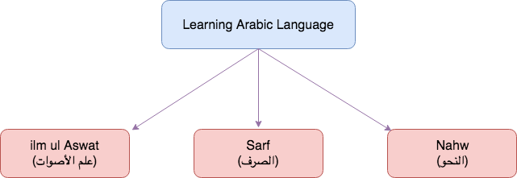
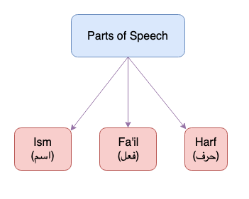
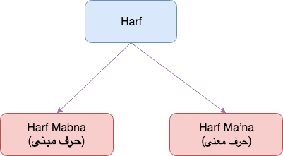
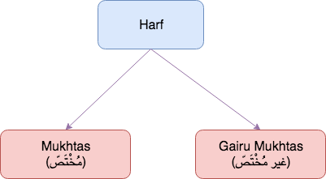

**Arabic**{: .firstword} is a Semitic language based on tri-literal roots. It's the official language of 26 states and Modern Standard Arabic is one of six official languages of the United Nations.  

<br/>

Arabic is also the language of Quran and we should understand that Quran is an *Arabic phenomenon*. The words and sentence constructions Allah chose to deliver the message is immaculate and prestine. 

<br/>

I think, Learning Basic Arabic Grammar rules should be the first step forward to any Muslim whose native tongue is not Arabic and I would further argue we all should learn Arabic grammar for understanding Quran to cherish its beauty. 


<br/>

Allah says in Quran,  
> ولقد يسرنا القرآن للذكر فهل من مدكر (Ref 54:17, 54:22 ,54:32, 54:40 )  
> And We have certainly made the Qur'an easy for remembrance, so is there any who will remember? 

<br/>

**If Quran is made easy by Allah, so is the language of Quran. And so is its grammar.**

<br/>

There are many Arabic grammar courses available online and free of cost. Indo/Pak people may learn Arabic grammar in Urdu but I see a huge resource for people who know English and would like to learn Arabic grammar in English.

<br/>

In this post, I would like to summarize basics of Arabic grammar for beginners. We will discuss parts of speech in Arabic grammar, verbs in Arabic grammar, nouns in Arabic grammar in simple English. These basic Arabic grammar rules will serve as the foundation for a beginner.

<br/>

So, without further ado, lets begin and make the basics of Arabic grammar super easy ;) (إن شاء الله)

<br/>

First things first, 

## How to begin learning Arabic Grammar?

<br/>

Learning any language begins with learning its alphabets then words and then we make sentence. Similarly, Learning Arabic language can be broadly classified into 3 broad categories,
- **Ilm ul Aswat (علم الأصوات)**{: .heading1}
- **Sarf (الصرف)**{: .heading1}
- **Nahw (النحو)**{: .heading1}

{:title="3 classifications of Learning Arabic Language"}

### Ilm ul Aswat (علم الأصوات)
This is the first level of studying Arabic language in which we study letters e.g. ي،د،ح etc. We learn,
- How to pronounce letters.
- Understand point of articulation of letters i.e. *Makhraj* (مخرج)
- Understand characteristics of letters i.e. *Sifat* (صفات)  

<br/>

A part of this ilm comes under study of Tajweed.

### Sarf (الصرف)
This is the second level where we study the whole word (كَلِمَة) e.g. زيد, يدخل, ثُمّ. We study the rules related to a word e.g. 
- فعل مجرد 
- فعل مزيد

<br/>

And so on ...

### Nahw (النحو)
This is the third level in which we study the entire sentence i.e. *Jumla* (الجُمل) OR *Kalam* (الكلام). One fine point is in النحو, We study كَلِمَة in الجُملة, **Not** كَلِمَة by itself.

<br/>

Before moving forward to *parts of speech*. I would love to quickly discuss,  

<br/>

**Definition of Kalam (الكلام)**{: .heading1}  
**تعريف الكلام عند النحوين**

In Simplest definition, Kalam is
> اللفظ المفيد

<br/>

Meaning ``` Useful expression ```, And by Useful we meant when we finish our talking (i.e. الكلام) the listener is not waiting for anything else.  
Example:
- جاء زيد إلى البيت (Zaid came to the House) is a full statement (اللفظ المفيد)
- ... إن جاء زيد إلى البيت (If Zaid came home ...) is **Not** full statement (اللفظ غيرُ المفيد) because the listener is waiting for the rest of the sentence.

<br/>

That's enough covering the generalities, let's quickly begin the discussion for 

## Part of Speech in Arabic Grammar
**أقسام الكلام**{: .arabic}

There are 3 parts of Speech in Arabic Grammar. Every word that we read/speak will fall into following 3 categories,  

1. **Ism (اسم)**{: .heading1}  
2. **Fa'il (فعل)**{: .heading1}  
3. **Harf (حرف)**{: .heading1}  

{:title="3 Parts of Speech in Arabic Language"}

### Ism (اسم)
Ism in Arabic Grammar can be compared to nouns in English language (Caveat: I want to keep it simple ) e.g. زيد ,فاطمة ,كتاب etc. To identify اسم from an Arabic sentence there are few signs, which we will discuss now.  

<br/>

**Signs of Ism (علاماتُ الاسم)**{: .heading1}  
There are multiple signs of a word being Ism. But here we will discuss 4 of them which are as follows,  

1. If we find ال on any word then that word is Ism e.g. **الحمد**{: .bg-yellow} لله (All praise and gratitute belongs to Allah)
> دخول ال

2. If we find tanween on a word then that word is Ism e.g. جاء **زيدٌ**{: .bg-yellow} (Zaid Came)  
  > التنوين

3. If we find Harf Jar (Oops I've used *Harf* without defining it, be patient we will learn about it soon إن شاء الله) before any word then that word is Ism e.g. من **البيتِ**{: .bg-yellow} (from house). Here, house is Ism as it is followed by Harf Jar (من)  
  > دخول حرف الجر على الكلمة  

4. If a word is مجرور (Majroor) then it is Ism. A word can be مجرور without even having Harf Jar before it for e.g. كتابُ **اللهِ**{: .bg-yellow} (Book of Allah) where كتابُ is *Mudhaf ilaihi* (مضاف اليه) so is مجرور. OR من البيتِ **البعيدِ**{: .bg-yellow} (From far house) where البعيدِ is *Sifa* (صفة) of البيتِ and is مجرور.  
  > الجر


### Fa'il (فعل)
Fa'il in Arabic grammar can be compared to verbs in English language e.g. كتب ,يذهب ,اخرج

<br/>

**Signs of Fa'il (علامات الفعل)**{: .heading1}  
There are multiple signs of a word being Fa'il. But here we will discuss 4 of them which are as follows  

1. If we find قد before a word then it is الفعل e.g. قد **ذهب**{: .bg-yellow}, قد **يذهب**{: .bg-yellow}.  
**Note**: This sign works with both *Fa'il Madhi* (فعل ماض) and *Fa'il Mudhari* (فعل مضارع). (Details of فعل ماض and فعل مضارع can be found in [Verbs in Arabic Grammar](/verbs-in-arabic-grammar/) article)
  > دخول قد
2. If we find *Seen* (السين) Or *Sawfa* (سوف) before a word then it is الفعل e.g. **س**{: .bg-yellow}أذهب Or **سوف**{: .bg-yellow} أذهب.  
**Note**: This sign works with فعل مضارع only.
  > دخول السين أو سوف
3. If we find لم before a word then it is الفعل e.g. لم **أذهب**{: .bg-yellow} إلى البيت.  
**Note**: This sign works with فعل مضارع only.
  > (دخول ( لم
4. If we find تاء المتكلم at the end of a word then it is الفعل e.g. ذهب**ت**{: .bg-yellow} OR خرج**ت**{: .bg-yellow}.  
**Note**: This sign works with فعل ماض
  > دخول تاء المتكلم

<br/>

Above signs identify فعل ماض and فعل مضارع, but we have *Fa'il Amr* (فعل الأمر) also in Arabic language. فعل الأمر must have following two characteristics,  

1. It has to be a command
  > أن يدل على الأمر
2. It has to be derived from فعل e.g. قُل is derived from قال OR it should accept ياء المخاطبة e.g. اذهبي from verb اذهب
  > أن يكون مشتقاً من فعل  
  > أو  
  > أن يقبل ياء المخاطبة

<br/>

**NOTE:** We have added second condition because there are certain الأمر in Arabic language which are not derived from فعل Or which doesn't accept ياء المخاطبة.  

Example: **حيَّ**{: .bg-yellow} على الصلاة (Come to prayer) here حيَّ is not فعل الأمر but it is ``` اسم فعل ```.

### Harf (حرف)
Harf in Arabic grammar can be compared to prepositions in English language e.g. ... من   إلى  عن  على.  

<br/>

**Signs of Harf (علامة الحرف)**{: .heading1}  
There are **No Signs**{: .bg-yellow} for Harf
> ليس له علامة

<br/>

People might say, "Why there is no sign for Harf."  
*My Response*: See, At times no Sign is a sign in itself. (I copied my teacher ;)

Lemme explain,  
**ج**{ .bg-yellow .heading1}: This letter has a sign in middle, implying it is Geem.  
**خ**{ .bg-yellow .heading1}: This letter has a sign on top, implying it is Kha.  
**ح**{ .bg-yellow .heading1}: This letter has **NO Sign**, implying it is Haa.  

<br/>

See How amazing ;)  

<br/>

Same thing is with Harf. If we do't see علاماتُ الاسم and علامات الفعل on a word, then this is the sign that **it is actually Harf**{: .bg-yellow}

<br/>

حرف is further divided into 2 categories  

{:title="2 Types of Harf"}

**حرف مبنى**{: .heading1} (Harf Mabna)
- These are simply Arabic alphabets e.g. ... أ – ب – ت – ث –ج –ح, we call them ``` حروف الهجاء ```
- They are called ``` مبنى ``` because we make words from these حرف  

<br/>

**حرف معنى**{: .heading1} (Harf Ma'na)
  - ``` معنى ``` implies these حرف have meanings e.g. ... من (from) ,إلى (towards) , ك (similar to) ,لِ (for)

<br/>

There is another category in which Harf is divided into two,  

{:title="2 Types of Harf"}

**مُخْتَصّ**{: .heading1} (Mukhtas)
- Harf which comes either with Ism or Fa'il,
  - Ism(s) e.g. في in **في البيت**{: .bg-yellow} 
  - Fa'il e.g. لم in **لم أذهب**{: .bg-yellow}
- Harf مختص usually (**NOT ALWAYS**) affects the word after it e.g. في made البيت in Jar etc.

<br/>

**غير مُخْتَصّ**{: .heading1} (Gairu Mukhtas)
- Harf which comes with both Ism or Fa'il e.g.
  - **هل**{: .bg-yellow} محمد هنا؟ (Usage with Ism)
  - **هل**{: .bg-yellow} جاء محمد؟

<br/>

الحمد لله people I feel I've covered enough details for beginners. And would like to conclude my article on **Parts of Speech in Arabic Grammar.**

## Reference
- [Qutoof Academy](https://www.qutoofacademy.com/){:target="_blank" rel="nofollow noopener"}
- [Arabic Wiki](https://en.wikipedia.org/wiki/Arabic){:target="_blank" rel="nofollow noopener"}