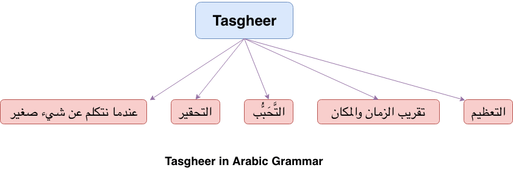

**Tasgheer**{: .firstword} comes from the word  

``` صغَّر  يُصَّغِر  التَّصْغِيْر ```  
meaning to belittle or decrease. Its opposite is كَبَّر and comes under study of Sarf.

<br/>

Oops did I hurl a technical Jargon at you !!! :/  
Don't worry lemme take a step back and refresh the definition of 

<br/>

**Sarf**{: .heading1}  
> In Sarf, we study the word itself **NOT** the word in the sentence

i.e. how the word changes without looking at the sentence.

<br/>

And since we are at it let me introduce its cousin, i.e. 

<br/>

**Nahw**{: .heading1}  
> In Nahw, we study the word in the sentence.

i.e. How this word is affected OR affected other words in the sentence. Example how the use of ``` انّ ``` changes the sentence and so on ...

<br/>

**But a burning question that we all want an answer of is ...**

## Why do we use Tasgheer?

<br/>

**Case 1**{: .heading1} **عندما نتكلم عن شيء صغير**{: .heading2}  
Suppose we want to say small book, we can either say, ``` كتابٌ صغير ``` Or its Tasgheer form ``` كُتيّب ```.

<br/>

But how we came up with this construction.  
Have patience I will add details :)

<br/>

**Reason 2**{: .heading1} **التحقير**{: .heading2}  
When we want to insult someone/something, we can use Tasgheer.  

<br/>

So in place of addressing a man by ``` رجُل ``` we say ``` رُجيل ``` meaning you are a small man ... lol

<br/>

**Reason 3**{: .heading1} **التَّحَبُّب**{: .heading2}  
When we are addressing someone we like/love e.g. our son, spouse etc, we can use Tasgheer.  

So in place of addressing a kid by ``` طِفْل ``` we say ``` طُفيل ```

<br/>

**Reason 4**{: .heading1} **تقريب الزمان والمكان**{: .heading2}  
Sometimes we use it for showing the nearness of time Or place.   
For example to show that its just right before Asr i.e. a few moments before Asr we will say ``` قُبَيْل العصر ``` instead of ```قَبل العصر```. As ```قَبل العصر``` may be used for 2 hours before Asr

<br/>

Similarly, to mean right before Masjid we say ```قُبَيْل المسجد``` instead of ```قبل المسجد```.

<br/>

**Reason 5**{: .heading1} **التعظيم**{: .heading2}  
Rarely we use Tasgheer for التعظيم.  
For exammple addressing a man (رجُل) but calling him ```رُجيل``` out of respect.

<br/>

That covers all the reasons I guess.  

{:title="Reason to use Tasgheer"}

<br/>

Moving on !!! Lets look into 

## Conditions required by an Ism to make it's Tasgheer

- **أن يكون الاسم معرباً**{: .heading1}   
We use Tasgheer with Mo'rab Ism only (Not Fail or Harf)  
**Exception**{: .exception}
  - ```ذا``` has Tasgheer i.e. ```ذَيَّا``` even though it is اسم إشارة **مبني**{: .bg-yellow}
  - ```الذي``` has Tasgheer i.e. ```اللَّذَيَّا``` even though it is **مبني**{: .bg-yellow}
  - ```التي``` has Tasgheer i.e. ```اللَّتَيَّا``` even though it is **مبني**{: .bg-yellow}

<br/>

- **أن يكون الاسم قابلاً للتصغير**{: .heading1}  
Ism should accept Tasgheer. There are certain Ism's for which we can't make Tasgheer for e.g.
  - Names of Allah (أسماء الله)
  - Names of prophet (أسماء الأنبياء)
  - Names of Angels (أسماء الملائكة)

<br/>

Above are the two major rules. Now we will learn

## How to make Tasgheer
To make Tasgheer, there are multiple forms (صيغ) in Arabic language. Let's look into it one by one beginning with

### فُعَيْل

This form is used in following categories,   
**Category 1**{: .heading1} **Three letters Ism (الاسم الثلاثي)**  
**Transformation Rule of Tasgheer:**{: .heading2} Add Damma on first letter and ي after second letter.   
For example فلس has three letters, its tasgheer is فُليس

<br/>

**Category 2**{: .heading1} **Three letters feminine Ism**  
**Transformation Rule of Tasgheer:**{: .heading2} (Add Damma on first letter and ي after second letter) + add تاء التأنيث.  
For example Tasgheer of 
  - ```عَين``` is ```عُيينة```
  - ```أُذُن``` is ```أُذُينة```
  - ```قدر``` is ```قُدَيْرَة```
  - ```نار``` is ```نُويرة``` (here ا is changed to و)
  > إذا كان الاسم المُصَغَّر مؤنثاً يجب أن نزيد تاء التأنيث

<br/>

**Category 3**{: .heading1} **Three letters Ism with second letter as Alif**  
**Transformation Rule of Tasgheer:**{: .heading2} (Add Damma on first letter and ي after second letter) + Change ا to its original letter  

<br/>

For example, in باب we need to figure out whether ا is in place of و or ي i.e what is Asl of ا, for that we will   look into plural of باب which is أبواب. So through plural we know ا in باب is in place of و (i.e. باب is originally بوب). Hence, the tasgheer of ```باب``` will be ```بُوَيْب```.  
<br/>

Similarly, in ناب its plural is أنياب. So we know ا in ناب is in place of ي (i.e. ناب is originally نيب). Hence,   the tasgheer of ```ناب``` will be ```نُيَيْب```

<br/>

**Category 4**{: .heading1} **Three letter Isms ending with ة**  
**Transformation Rule of Tasgheer:**{: .heading2} (Add Damma on first letter and ي after second letter) + add letter which Arabs have dropped.

<br/>

For example in ```شفة``` its originally ```شَفْهَ``` , its tasgheer is ```شُفَيْهَة``` (we have added ة in the end as it is originally feminine).   

<br/>

Similarly, from ```شاة``` we have ```شُوَيهة``` (Here, ا in شاة is originally و)

<br/>

**Category 5**{: .heading1} **Four letters Ism where second letter is Alif (اسم رباعي ثاني حرف فيه ألف)**  
**Transformation Rule of Tasgheer:**{: .heading2} (Add Damma on first letter and ي after second letter) + Change ا to و.  

<br/>

For example راجل has four letters and second letter is ا, its tasgheer is رُويجل.  

<br/>

Similarly, tasgheer of ```فارس``` is ```فُويرس```. 

<br/>

**Category 6**{: .heading1} **Four letters Ism where third letter is Alif**  
**Transformation Rule of Tasgheer:**{: .heading2} (Add Damma on first letter and ي after second letter) + Change ا to ي.  

<br/>

For example كتاب has four letters and third letter is ا, its tasgheer is ```كُتَييب``` Or ```كُتَيّب``` (after Idhgham).  

<br/>

Similarly, tasgheer of ```غزال``` is ```غُزييل``` Or ```غُزيِّل``` (after Idhgham).

<br/>

**Category 7**{: .heading1} **Five letters Ism where fourth letter is Alif**  
**Transformation Rule of Tasgheer:**{: .heading2} (Add Damma on first letter and ي after second letter) + Change ا to ي.  

<br/>

For example دينار has five letters and fourth letter is ا, its tasgheer is ```دنينير``` 

<br/>

 If you are wondering from where that extra ن came, let me assure you, you are not alone. If we look at plural of ```دينار```, which is ```دنانير``` it also has an extra ن. Actually ```دينار``` was originally written as ```دنَّار```. Now we can easily apply tasgheer rules to ```دنَّار``` and make it ```دنينير```

<br/>

**Category 8**{: .heading1} **Five letters Isms**  
**Category 8a**{: .heading1} **If it has extra letters**   
**Transformation Rule of Tasgheer:**{: .heading2} (Add Damma on first letter and ي after second letter) + ٍٍRemove extra letter.  

<br/>

For example ```منطلق``` has ن as extra letter its tasgheer is ```مُطيلِق```. Similarly,
  - In ```مرتزق``` we have ت as extra letter its tasgheer is ```مُرَيْزِق```
  - In ```مستخرج``` we have ت and س as extra letter its tasgheer is ```مُخَيرِج```
  
<br/>

**Category 8b**{: .heading1} **If all letters are Original/Asl letters**  
**Transformation Rule of Tasgheer:**{: .heading2} (Add Damma on first letter and ي after second letter) + Remove last letter.  

<br/>

For example سَفَرْجَل has all Asl letters its tasgheer is ```سُفَيْرِج``` after removing ل at the end.

<br/>

**Side Note** By extra letters I mean the letters that we add in three lettered verb to make form II, from III ... form X etc (verb forms).  
For e.g. ```خرج``` is three lettered verb and all its letters are original. To make it form IV we add extra أ in front i.e. ```أخرج``` and for form X we add ا س ت i.e. ```استخرج```.  
There are only 10 extra letters, which are all letters of the word  ```سألتمونيها```

<br/>

**Category 9**{: .heading1} **Five letters Isms of form فعلان**  
**Category 9a**{: .heading1} **If it is Munsarif e.g. سِرْحانٌ**  
**Transformation Rule of Tasgheer:**{: .heading2} (Add Damma on first letter and ي after second letter) + Change ا to ي.  

<br/>

For example ```سِرْحانٌ``` will become ```سُرَيْحِين```  

<br/>

**Category 9b**{: .heading1} **If it is NOT Munsarif e.g. عثمانُ**  
**Transformation Rule of Tasgheer:**{: .heading2} Add Damma on first letter and ي after second letter.  

<br/>

For example ```عثمانُ``` will become ```عُثيمان```. Similarly, ```سكرانُ``` will become ```سُكيران```.

<br/>

**Category 10**{: .heading1} **Six letter Isms**  
**Transformation Rule of Tasgheer:**{: .heading2} Add Damma on first letter and ي after second letter.  

<br/>

For example زعفران has six letters, its tasgheer is ```زُعيفران```

<br/>

**Category 11**{: .heading1} **Two letter Isms**  
**Transformation Rule of Tasgheer:**{: .heading2} (Add Damma on first letter and ي after second letter) + Add what is dropped by Arabs.  

<br/>

For example 
  - ```دم``` is originally ```دَمَيٌ``` so its tasgheer is ```دُميي``` OR ```دُمَيَّ```.  
  - ```أخ``` is originally ```أخو``` so its tasgheer is ```أُخيو``` which is difficult to pronounce so we will convert و to ي i.e. ```أُخيو``` to ```أُخيي``` OR ```أُخَيَّ```.  
  - ```أب``` is originally ```أبو``` so its tasgheer is ```أُبيو``` which is difficult to pronounce so we will convert و to ي again i.e. ```أُبيو``` to ```أُبيي``` OR ```أُبَيَّ```

<br/>

### فُعَيعِل

This form is used in following category,  
**Category 1**{: .heading1} **Five letters Isms**  
**Category 1a**{: .heading1} **If it has extra letters**  
**Transformation Rule of Tasgheer:**{: .heading2} (Add Damma on first letter + ي after second and third letter) + remove extra letter.  

<br/>

For example 
  - ```منطلق``` has ن as extra letter its tasgheer is ```مُطيليق```
  - ```مرتزق``` we have ت as extra letter its tasgheer is ```مُرَيْزِيق```
  - ```مستخرج``` we have ت and س as extra letter its tasgheer is ```مُخَيرِيج```

<br/>

**Category 1b**{: .heading1} **If all letters are Original/Asl letters**  
**Transformation Rule of Tasgheer:**{: .heading2} (Add Damma on first letter + ي after second and third letter) + remove last letter.  

<br/>

For example سَفَرْجَل has all Asl letters its tasgheer is ```سُفَيْرِيج``` after removing ل at the end

## Exceptional Tasgheer

- Tasgheer of ```إنسان``` is ```أُنَيْسِيَان``` instead of ```أُنَيسِين```
- Tasgheer of ```مغرب``` is ```مُغَيْرِبَان``` instead of ```مُغيرب```

<br/>

### Conclusion
That's all folks I tried to organise the rules of Tasgheer to the best of my capabilites with proper explanations. But if you think that you are not convinced with the reasoning provided above, then it is what it is because **That is how Arabs said it !!!.**

## Reference
- [Qutoof Academy](https://www.qutoofacademy.com/){:target="_blank" rel="nofollow noopener"}

<!-- **فُعَيْعِيل**{: .heading1} -->