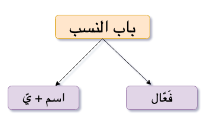

**Nasb**{: .firstword} or **نسب**{: .firstword} in Arabic helps us to attribute/associate a person to particular country, city etc. Suppose we want to say this person is from Misr, we will say  

```هذا مصري```

<br/>

Where word ```مصري``` is made from word ```مصر``` by adding ```يّ``` known as ```ياء النسب``` in the end i.e.  

```مِصْرِ + يّ``` = ```مصري```    

<br/>

Sometimes, Arab makes Nasb in فَعّال form. We mostly use this form in the names of people involved in a handicraft. For example,
- ```حَدَّاد``` (blacksmith) from ```حديد```
- ```نجَّار``` (Carpentar)
- ```بَقَّال``` (Owner of Grocary)
- ```حذّاء``` (shoemaker)

{:title="Nasb forms"}

## Categories of Nasb
Nasb forms can only be made with Nouns (اسم) and is divided into following categories,

**Category 1**{: .heading1} **Three letter nouns having ة مربوطة at end**  
**Transformation Rule of Nasb:**{: .heading2} Remove the ة and add ```يّ```  
For example, we have
  - ```مكة``` => ```مكّ``` => ```مَكِّيّ```
  - ```شجرة``` => ```شجر``` => ```شجرِيّ```
  - ```حنيفة``` => ```حنيف``` => ```حنفِيّ```
  - ```بصرة``` => ```بصر``` => ```بصريّ```

> إذا كان في آخر الاسم المنسوب تاء تأنيث يجب أن نحذفها

<br/>

**Category 2**{: .heading1} **Nouns having الاسم المقصور at end**  
**Category 2a**{: .heading1} **Three letter nouns having ا as third letter (إذا كان الألف الحرف الثالث)**  
**Transformation Rule of Nasb:**{: .heading2} Turn ا into و and add ```يّ```  
For example, we have
- ```فتى``` => ```فتو``` => ```فتوِيّ```
- ```ربا``` => ```ربو``` => ```رِبَوِيّ```

<br/>

**Category 2b**{: .heading1} **Four letter nouns having ا as fourth letter (إذا كان الألف الحرف الرابع)**  
- If second letter has harakah (الحرف الثاني متحرك)  
**Transformation Rule of Nasb:**{: .heading2} Drop ا and add ```يّ```  
For example, we have
  - ```كنَدا``` => ```كَنَد``` => ```كندِيّ```

<br/>

- If second letter has Sukun (الحرف الثاني ساكن)  
  - **Transformation Rule of Nasb (Option 1):**{: .heading2} Drop ا and add ```يّ```  
For example, we have
    - ```حبلى``` => ```حبل``` => ```حُبْلِيّ```
    - ```دنيا``` => ```دني``` => ```دنييّ```  

  - **Transformation Rule of Nasb (Option 2):**{: .heading2} Turn ا into و and add ```يّ```  
For example, we have
    - ```حبلى``` => ```حبلو``` => ```حُبْلَوِيّ```
    - ```دنيا``` => ```دنيو``` => ```دنيويّ```

<br/>

**Category 2c**{: .heading1} **Five letter nouns having ا as fifth letter (إذا كان الألف الحرف الخامس)**  
**Transformation Rule of Nasb:**{: .heading2} Drop ا and add ```يّ```  
For example, we have
- ```مصطفى``` => ```مصطف``` => ```مصطفِيّ```
- ```فرنسا``` => ```فرنس``` => ```فرنسيّ```  
**Note**: Same rule can be applied with words having ا as sixth letter or more than that

## Reference
- [Qutoof Academy](https://www.qutoofacademy.com/){:target="_blank" rel="nofollow noopener"}