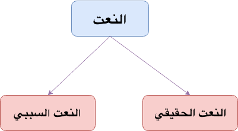

**Tawabi'**{: .firstword} or **التوابع**{: .firstword} is a plural of word ```تابع```.  

```تابع``` comes from  

```تبع  يتبع```  
meaning `to follow`

<br/>

Tawabi' follows what is before it in I'rab and has no I'rab of its own
> التوابع تتبع ما قبلها في الإعراب وليس لها إعراب خاص

<br/>

For example, in رأيت **الطالبَ**{: .bg-yellow} **المجتهدَ**{: .bg-cyan}, we have ```المجتهدَ``` is following ```الطالبَ``` in I'rab (as Sifa)

<br/>

There are four types of Tawabi'
- النعت
- العطف
  - عطف نسق
  - عطف بيان
- التوكيد
- البدل

{:title="Four Types of Tawabi"}

<br/>

## **النعت**{: .arabic}
النعت comes from the word  

``` نعت  ينعت  انعت  النعت ```

meaning characteristic OR features. It is synonymous to word ```صفة```

<br/>

Types of النعت

- النعت الحقيقي
- النعت السببي

{:title="nait"}

<br/>

### **النعت الحقيقي**{: .arabic}
In this النعت, we describe noun before it i.e. 
> ينعت اسماً سابقاً عليه

<br/>

For example
- In جاء الطالبُ **المجتهدُ**{: .bg-yellow}, here ```المجتهدُ``` describe ```الطالبُ``` before it (Raf Construction)
- In رأيت الطالبَ **المجتهدَ**{: .bg-yellow}, here ```المجتهدَ``` describe ```الطالبَ``` before it (Nasb Construction)
- In ذهبت إلى الطالبِ **المجتهدِ**{: .bg-yellow}, here ```المجتهدِ``` describe ```الطالبِ``` before it (Jar Construction)
- In جاء الطلابُ **المجتهدُون**{: .bg-yellow}, here ```المجتهدُون``` describe ```الطلابُ``` before it (Plural Construction)
- Quranic Example:
  - فَفَتَحْنَا أَبْوَابَ السَّمَاءِ بِمَاءٍ **مُّنْهَمِرٍ**{: .bg-yellow}
  - إِنَّا أَرْسَلْنَا عَلَيْهِمْ رِيحًا **صَرْصَرًا**{: .bg-yellow} فِي يَوْمِ نَحْسٍ **مُّسْتَمِرٍّ**{: .bg-yellow}
  - وَمَنْ أَظْلَمُ مِمَّنِ افْتَرَىٰ عَلَى اللَّهِ الْكَذِبَ وَهُوَ يُدْعَىٰ إِلَى الْإِسْلَامِ ۚ وَاللَّهُ لَا يَهْدِي الْقَوْمَ **الظَّالِمِينَ**{: .bg-yellow}

<br/>

النعت follows المنعوت in following things
- **I'rab (الإعراب)**{: .heading1}
  - Example: جاء الطالبُ المجتهدُ, both الطالبُ and المجتهدُ are Raf
- **In Gender (النوع i.e. في التذكير والتأنيث)**{: .heading1}
  - Example: جاءت الطالبة المجتهدة, both الطالبة and المجتهدة are Feminine
- **In Count (العدد i.e. الإفراد – التثنية – الجمع)**{: .heading1}
  - Example: جاء الطالب **المجتهد**{: .bg-yellow} (Singular), جاء الطالبان **المجتهدان**{: .bg-yellow} (Dual), جاء الطلاب **المجتهدون**{: .bg-yellow} (Plural)
- **In Definite/Indefinite(التعريف والتنكير)**{: .heading1}
  - Example: جاء الطالب **المجتهد**{: .bg-yellow} (Definite), جاء طالب **مجتهد**{: .bg-yellow} (Indefinite)

<br/>

**Exception Rule**{: .exception}  
If المنعوت is Plural (جمع) + Feminine (مؤنث) + NOT Rational (غير عاقل), We can use Singular or Plural النعت.  
For Example,
- هذه بيوت **عالية** (Singular النعت) 
- هذه بيوت **عاليات** (Plural النعت) 
- هذه بيوت **عوال** (Plural Takseer النعت)

<br/>

### **النعت السببي**{: .arabic}
In this النعت, we describe noun after it i.e. 
> ينعت اسماً يأتي بعده

<br/>

For example  
In جاء طالبٌ مجتهدٌ أخوه (Student came whose brother is hardworking)
- ```ه``` which returns to ```طالبٌ``` is a must have
- ```طالبٌ``` is ```منعوت``` in grammar even though `مجتهدٌ` is describing `أخ` in meaning
- ```أخو``` is ```فاعل``` as ```مجتهدٌ``` in this sentence acts as Ism fa'il i.e. in meaning of ``يجتهد``

<br/>

Irab of  جاء طالبٌ مجتهدٌ أخوه will be,

> **طالب**{: .arabic .irab}
(فاعل (منعوت

<br/>

> **مجتهد**{: .arabic .irab}
نعت سببي مرفوع

<br/>

> **أخو**{: .arabic .irab}
فاعل مرفوع بالواو

<br/>

**Quranic Example**  
> ربنا أخرجنا من هذه القريةِ الظالمِ أهلُها

<br/>

Irab of ربنا أخرجنا من هذه القريةِ الظالمِ أهلُها will be,

> **القرية**{: .arabic .irab}
بدل مجرور

<br/>

> **الظالم**{: .arabic .irab}
نعت سببي مجرور

<br/>

> **أهل**{: .arabic .irab}
فاعل مرفوع

<br/>

النعت السببي follows المنعوت (i.e. the noun before it) in following things
- I'rab (الإعراب)
  - Example: رأيت **طالباً**{: .bg-yellow} **مجتهداً**{: .bg-yellow} أخوه, here ``مجتهداً`` follows `طالباً`
- In Definite/Indefinite(التعريف والتنكير)
  - Example: رأيت **طالباً**{: .bg-yellow} **مجتهداً**{: .bg-yellow} أخوه, here ``مجتهداً`` follows `طالباً`

<br/>

النعت السببي follows الاسم اللاحق (i.e. the noun after it) in following things
- In Gender (النوع i.e. في التذكير والتأنيث)
  - Example: رأيت **طالباً**{: .bg-yellow} **مجتهدةً**{: .bg-yellow} أختُه, here ``مجتهدةً`` follows `أختُ`

<br/>

We can also divide ```النعت``` as
- نعت مفرد i.e. it is not Jumla or Shibu Jumla (ليس جملة ولا شبه جملة)
  - Example: رأيت طالباً **مجتهداً**{: .bg-yellow}
- النعت الجملة
  - Example: رأيت طالباً **يقرأ الكتاب**{: .bg-yellow} here `يقرأ الكتاب` is `الجملة الفعلية في محل نصب نعت`
  - Example: سمعت طالباً **قراءتُه جميلة**{: .bg-yellow} here `قراءتُه جميلة` is `الجملة الاسمية في محل نصب نعت`
  - Example: رأيت طالباً **في المسجد**{: .bg-yellow} here `في المسجد` is `وشبه الجملة في محل نصب نعت` OR `وشبه الجملة متعلق بنعت محذوف تقديره كائناً`

<br/>

**Golden Rule**
- الجمل وأشباه الجمل بعد النكرات صفات
- الجمل (وأشباه الجمل) بعد النكرات صفات وبعد المعارف أحوال

<br/>

## **العطف**{: .arabic}

العطف is divided into two categories
- عطف بيان Or البدل
- عطف نسق

{:title="Atf"}

<br/>

Let's start with 

### **عطف نسق**{: .arabic}
In عطف نسق, we use حروف العطف which are 10 in number. First being

<br/>

**الواو**{: .heading1}  
The word coming after و share the same Hukm or meaning.  
For example in `جاء زيدٌ وعمروٌ`, 
- `و` is `حروف العطف`
- `عمروٌ` is `معطوف مرفوع` and in the meaning of `فاعل`. 
- `زيدٌ` and `عمروٌ` share the same meaning i.e. `جاء`
- We can't say who came first it can be Zaid or Amr or both can come together. That's why `الواو` is known as `تفيد مُطْلق المشاركة`
- Quranic Example: 
  - يَا أَيُّهَا الَّذِينَ آمَنُوا قُوا أَنفُسَكُمْ وَ**أَهْلِيكُمْ**{: .bg-yellow} نَارًا وَقُودُهَا النَّاسُ وَ**الْحِجَارَةُ**{: .bg-yellow}

<br/>

**الفاء**{: .heading1}  
This harf provides `الترتيب` i.e. order and `التعقيب` i.e. the meaning of right after him.  
For example in `جاء زيدٌ فعمروٌ`,
- `ف` is `حروف العطف`
- Zaid came first
- Amr came immediately after zaid
- Quranic Exapmle: 
  - فتلقى آدم من ربه كلمات **ف**{: .bg-yellow}تاب عليه

<br/>

**ثم**{: .heading1}  
This harf provides `الترتيب` i.e. order  and `التراخي` i.e. the meaning of after a while.  
For example in `جاء زيدٌ ثم عمروٌ`,
- `ثم` is `حروف العطف`
- Zaid came first
- Amr came a while after zaid

<br/>

**حَتَّى**{: .heading1}  
This harf is mostly used as Harf Jar and sometimes as Harf Atf.  

We use حَتَّى for  
- **بيان الشرف**{: .heading2}
  - For example: يموت الناسُ حتى الأنبياءُ meaning People will die even the prophets (will die)
  - In above statement we start from common people to prophets i.e. from general to high. After حَتَّى we mentioned someone honorable.
- **بيان الخِسَّة**{: .heading2}
  - For example: يرزق اللهُ الناسَ حتى الكفارَ meaning Allah will provide the rizk to the people even to the Kafir
  - In above statement we start from common people to disbelievers i.e. from general to low.After حَتَّى we mentioned someone very bad.
- **بيان العموم**{: .heading2}
  - For example: أكلتُ السمكةَ حتى رأسَها meaning I ate the fish till its head (i.e. I ate all the fish)
  - In above statement we have same category after حَتَّى.

<br/>

Lets ponder over حَتَّى more by taking following examples,

**Case 1:**{: .heading1} **حَتَّى As Harf Atf**  
حَتَّى can come as حرف عطف.  
For e.g. 
- أكلتُ السمكةَ حتى **رأسَها**{: .bg-yellow} (I ate the fish with its head)
  - **حتى**{: .arabic .irab}
  حرف عطف
  
  - **رأس**{: .arabic .irab}
  معطوف منصوب 

- جاء الحجاجُ حتى الضعفاءُ

<br/>

**Case 2:**{: .heading1} **حَتَّى As Harf استئناف**  
حَتَّى can come as حرف استئناف meaning we use it at the beginning of the sentence.  
For e.g.أكلتُ السمكةَ حتى **رأسُها**{: .bg-yellow} (I ate the fish with its head)

**Note:** خبر of رأسُها is estimated as أكلته

<br/>

- **حتى**{: .arabic .irab}
حرف ابتداء

- **رأس**{: .arabic .irab}
مبتدأ مرفوع 

<br/>

In this case either الجملة الاسمية or الفعل الماضي can come after Hatta.  
- الجملة الاسمية example: جاء الطلاب **حتى**{: .bg-yellow} علي جاء
- الفعل الماضي example: لم أذهب **حتى**{: .bg-yellow} قرأت الكتاب

<br/>

**Case 3:**{: .heading1} **حَتَّى As Harf Jar**  
حَتَّى can come as حرف جر.  
For e.g. أكلتُ السمكةَ حتى **رأسِها**{: .bg-yellow} (I ate the fish till its head (i.e. He hasn't eaten the head))

- **حتى**{: .arabic .irab}
حرف جر

- **رأس**{: .arabic .irab}
اسم مجرور 

<br/>

In this case either اسم or الفعل المضارع can come after Hatta.  
- Quranic Example: **حتى**{: .bg-yellow}  مطلعِ الفجر (here مطلعِ is اسم)
- (لن أذهب **حتى**{: .bg-yellow} أقرأَ الكتاب  (حتى قراءةِ الكتاب

<br/>

{:title="Hatta forms"}

<br/>

**أَمْ**{: .heading1}  
أَمْ is divided into two types
- حرف عطف للتسوية
  - In this `أَمْ` comes with `سواء` and `أ` (known as `حرف تسوية`)
  - Example: **سواء**{: .bg-cyan} عليهم **أ**{: .bg-cyan}أنذرتهم **أم**{: .bg-yellow} لم تنذرهم. In this sentence warning them is equal to not warning them 
  - Quranic Example: سواء علينا **أ**{: .bg-cyan}جزعنا **أم**{: .bg-yellow} صبرنا
- حرف عطف للتعيين
  - In this `أَمْ` comes with `أ` known as `حرف استفهام`
  - تعيين means to choose one among them
  - Example: **أ**{: .bg-cyan}جاء زيد **أم**{: .bg-yellow} عمرو؟. In this sentence I'm sure one among Zaid and Amr came but don't know who came exactly

<br/>

**أو**{: .heading1}  
أو is divided into two types  
- حرف عطف للإباحة
  - Example: ادرس النحو **أو**{: .bg-yellow} الصرفَ. This sentence implies we studied either Sarf Or either Nahw Or we studied both
- حرف عطف للتخيير
  - Example: تزوج هنداً **أو**{: .bg-yellow} أختَها. This sentence implies you can marry either Hind or her sister but not both

<br/>

Quranic Example:
  - لبثنا يوما **أو**{: .bg-yellow} بعض يوم
  - فكفارته إطعام عشرة مساكين من أوسط ما تطعمون أهليكم **أو**{: .bg-yellow} كسوتهم **أو**{: .bg-yellow} تحرير رقبة
  

<br/>

**لكن**{: .heading1}  
This harf is used for corrections i.e. للاستدراك .  

<br/>

It becomes harf Atf under two conditions
- و doesn't come before it (لا تأتي قبلها واو)
- There is a negation before it (أن يكون قبلها نفي أو نهي)

Example: **لم**{: .bg-yellow} أقرأ الدرس **لكن**{: .bg-yellow} حفظت القرآن

<br/>

**لا**{: .heading1}  
This harf is used for negating the Hukm of المعطوف i.e. تفيد نفي الحكم عن المعطوف. 

<br/>

It becomes harf Atf under two conditions
- Negation doesn't come before it (ألا يكون قبلها نفي)
- It doesn't come with harf Atf (ألا تأتي مع حرف عطف)

Example: جاء زيدٌ **لا**{: .bg-yellow} عمروٌ meaning Zaid came and Amr didn't come

<br/>

If we use negation and a harf Atf (e.g. و) then لا will not be harf Atf.  
For example, in **ما** جاء زيد **ولا** عمرو, here الواو is  حرف عطف and لا is حرف زائد لتوكيد النفي


<br/>

**بل**{: .heading1}  
It is divided into two
- حرف عطف للإضراب 
  - When بل is used for correcting the information presented in first part of the sentence.  
  - **Rule** The first part of sentence must not have any negation. (الكلام قبها موجب)
  - Example: سوريا في إفريقيا **بل**{: .bg-yellow} آسيا meaning Syria is in Africa rather its in Asia. In this sentence we corrected that Syria is not in Africa but its in Asia
- الإقرار ثم المخالفة
  - When بل is used to give opposite meaning of what is mentioned in first part of sentence.
  - **Rule** The first part of sentence must have negation.
  - Example: **لم**{: .bg-cyan} يحضر زيد **بل**{: .bg-yellow} عمرو meaning Zaid did not attend rather Umar (i.e. Umar attended). So the first part of sentence is correct and second part after بل is opposite in meaning w.r.t. first part

<br/>

**إمَّا**{: .heading1}  
There is a debate among the Ulema whether this Harf is Atf or not.  
Imam Hariri considers إمَّا as harf Atf.  

<br/>

It has similar meaning of او (in إباحة and تخيير ). 

<br/>

We need to have two إمَّا in a single sentence for it to be treated as Harf Atf.  
For example in sentence, ادرس **إمَّا**{: .bg-yellow} النحوَ و**إمَّا**{: .bg-yellow} الصرفَ  
- First إمَّا is not Harf Atf (No debate among Ulema)
- Secong إمَّا is harf Atf i.e. حرف عطف مبني على السكون (In this Ulema differs some say it is harf Atf some say it is not)
- الواو is حرف زائد لا محل له

<br/>
 
Below chart lists all the عطف نسق

{:title="Atf Nask"}

## **التوكيد**{: .arabic}

There are two types of التوكيد
- توكيد معنوي 
- توكيد لفظي

{:title="Tawkeed"}

<br/>

Let's begin by discussing ...

### **توكيد معنوي**{: .arabic}
In التوكيد المعنوي, we use specific words (ألفاظ خاصة) to make التوكيد. They are as follows,
- نفس
- عين
- كُلُّ
- كلا 
- كلتا
- جميع 
- عامة

<br/>

**Use of نفس/عين**{: .heading2}  
We use نفس OR عين to remove any ambiguity.  
For example in `جاء الملك نفسُه` (King himself came)

> نفس
: توكيد مرفوع وعلامة رفعه الضمة

<br/>

In above sentence, if we have just said `جاء الملكُ` then it *MAY* mean that king has sent someone on his behalf but by using `نفسُه` we have removed all the ambiguity.

Similarly, we have
- جاء زيدٌ نفسُه
- رأيت زيداً نفسَه
- ذهبت إلى زيدٍ نفسِه

In all above examples, زيد is مؤكد and نفس is توكيد

<br/>

**Use of كُلُّ**{: .heading2}  
For things like a book (which have parts) we can use كلَّه, for example when I say  

`قرأت الكتابَ كلَّه`  
I mean I've read all the book (not a single page is left)

<br/>

Quranic Example: 
- هَا أَنتُمْ أُولَاءِ تُحِبُّونَهُمْ وَلَا يُحِبُّونَكُمْ وَتُؤْمِنُونَ بِالْكِتَابِ **كُلِّ**{: .bg-yellow}هِ
- وَلَقَدْ أَرَيْنَاهُ آيَاتِنَا **كُلَّ**{: .bg-yellow}هَا فَكَذَّبَ وَأَبَىٰ 

<br/>

**Use of كلا OR كلتا**{: .heading2}  
We use كلا OR كلتا for Dual.  
For example
-  جاء الطالبان كلاهما (Masculine)
- جاءت الطالبتان كلتاهما (Feminine)

<br/>

**Use of جميع**{: .heading2}  
We use جميع with plural.  
For example in جاء الطلابُ **جميعُ**{: .bg-yellow}هم (here جميعُ is توكيد and هم goes back to الطلابُ).

<br/>

We have a similar construction جاء الطلابُ **جميعاً**, here جميعاً is حال منصوب وعلامة نصبه الفتحة not توكيد

<br/>

Quranic Example:  
فسجد الملائكةُ **كلُّ**{: .bg-yellow}هم **أجمعون**{: .bg-yellow}

> كل
: توكيد مرفوع وعلامة رفعه الضمة

> أجمعون
: توكيد مرفوع وعلامة رفعه الواو

### **توكيد اللفظي**{: .arabic}
In التوكيد اللفظي, we have repetition of word (تكرار اللفظ) or meaning (معناه).  
For example,
- In `جاء جاء زيد` we have repetition of word جاء
- In `نعم نعم جاء زيد` we have repetition of word نعم
- In **الصلاةُ**{: .bg-yellow} **الصلاةُ**{: .bg-cyan} عمودُ الدينِ we have repetition of word الصلاة
  - **الصلاةُ**{: .bg-yellow}: مبتدأ مرفوع
  - **الصلاةُ**{: .bg-cyan}: توكيد لفظي مرفوع
- كتب**ت**{: .bg-yellow} **أنت**{: .bg-yellow} الدرس, here we have repeated meaning
- اسكن **أنت**{: .bg-yellow} وزوجك الجنة, here we have repeated meaning. Please note one أنت is hidden inside اسكن
- Quranic Example:
  -   وَالسَّابِقُونَ **السَّابِقُونَ**{: .bg-yellow} أُولَٰئِكَ الْمُقَرَّبُونَ

## **البدل**{: .arabic}
To understand البدل lets take an example,

`جاء الخليفةُ عمرُ`
> **الخليفة**{: .arabic .irab}
(فاعل مرفوع (مبدل منه

<br/>

> **عمر**{: .arabic .irab}
بدل مرفوع

here الخليفة and عمر represents same person i.e. الخليفة = عمر

<br/>

البدل has following 4 kinds  
- **(بدل كل من كل (بدل مطابق**{: .heading1}
  - Example: جاء الخليفةُ عمرُ here عمر is الخليفة Or in other words كل عمر is كل الخليفةُ
  - Quranic Example:
    - اهدنا **الصراطَ**{: .bg-yellow} المستقيم **صراطَ**{: .bg-yellow} الذين أنعمت عليهم here الصراطَ is بدل
    - قَالُوا آمَنَّا بِ**رَبِّ**{: .bg-yellow} الْعَالَمِينَ **رَبِّ**{: .bg-yellow} مُوسَىٰ وَهَارُونَ
    - وَقَالَ مُوسَىٰ لِأَخِيهِ **هَارُونَ**{: .bg-yellow} اخْلُفْنِي فِي قَوْمِي وَأَصْلِحْ وَلَا تَتَّبِعْ سَبِيلَ الْمُفْسِدِينَ
  - Also عطف بيان is equal to بدل كل من كل
- **بدل بعض من كل**{: .heading1}
  - Example: أكلت **التفاحة**{: .bg-yellow} **نصف**{: .bg-yellow}ها (I ate the Apple half of it). Here البدل is part of مبدل منه
  - **Rule 1:**  البدل (بعض) أقل من المبدل منه
  - **Rule 2:** البدل دائما يكون مضافاً إلى ضمير يعود على المبدل منه
- **بدل الاشتمال**{: .heading1}
  - In this البدل is not part of مبدل منه but it is like its part
  - Example: أحبُّ **الطالبَ**{: .bg-yellow} **خُلُقَ**{: .bg-yellow}ه (I love the student, his manners). In this خُلُقَ is not the student neither it is half of student (a material part of student) but a student has خُلُقَ. So its like its part not its material part.
- **بدل غلط**{: .heading1}
  - In this we correct a mistake in the sentence
  - Example: الكعبة في المدينةِ مكةَ. In this sentence we wanted to say Ka'ba is in Makka but we said Al Madina and then we corrected ourselves.

{:title="Types of Badl"}

<br/>

Phew !!

Take Deep Breath people. I know it's a lot but that how tawabi in Arabic works :)

## Reference
- [Qutoof Academy](https://www.qutoofacademy.com/){:target="_blank" rel="nofollow noopener"}