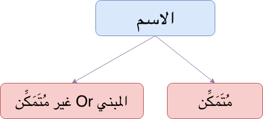
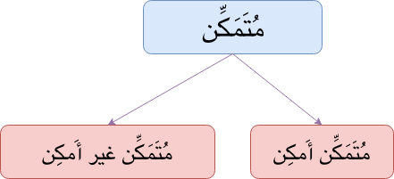

According to Ulema, Ism (الاسم) is divided into two
- مُتَمَكِّن
- غير مُتَمَكِّن Or المبني

{:title="Two Types of Isms"}

## **مُتَمَكِّن**{: .arabic}

It is divided into two

- **مُتَمَكِّن أَمكِن**{: .heading1}
  - It has all the features of a noun 
  - They are termed as الاسم المنصرف and accepts Damma, Fatha, Kasra.
  - They take Tanween
  - Example: كتابٌ, بنتٌ, رجل

- **مُتَمَكِّن غير أَمكِن**{: .heading1}
  - It has some features of Fa'il 
  - They are termed as Diptote Or Mamnu Min As Sarf (الممنوع من الصرف) and accepts only Damma and Fatha.
  - They don't take Tanween
  - Example: عمرُ

{:title="Two Types of Isms"}

## **غير مُتَمَكِّن**{: .arabic}
They are called غير متمكن because they don't look like a noun. Instead, they look like الحرف. Example: الضمائر  

**PS:** Why they look like harf require more detailed explanation which we out of scope of this tutorial

 

Moving deeper into the topic, Let's take a step back and define 

### **الصرف**{: .arabic}
`الصرف` is equal to `التنوين`, So  

`الممنوع من الصرف` is equivalent to `ممنوع من التنوين` which is equivalent to `ممنوع من الكسرة` i.e. ( يجر بالفتحة)

 

For example in `ذهبت إلى عمرَ`, here `عمرَ` is ممنوع من الصرف and has Fatha in Jar form.

 

But the burning question is

## Why we have Diptote Or Mamnu Min As Sarf
ُThe answer to the existence Diptote Or Mamnu Min As Sarf can be broadly divided into two categories,  

 

**Category 1**{: .heading1} When we need only **one reason** to explain why it is Diptote Or Mamnu Min As Sarf  

 

Those reasons can be as follows,  
**Reason 1**{: .heading2} If we have Alif of Feminine in the end i.e. ألف التأنيث المقصورة أو الممدودة  
Examples for ألف التأنيث المقصورة,
- ذهبت إلى **ليلى**{: .bg-yellow}
> **ليلى**{: .arabic .irab}
اسم مجرور وعلامة جره الفتحة نيابة عن الكسرة لأنه ممنوع من الصرف لوجود ألف التأنيث المقصورة
- حبلى

 

Examples for ألف التأنيث الممدودة,
- ذهبت إلى فتاةٍ **شقراءَ**{: .bg-yellow}
> **شقراءَ**{: .arabic .irab}
نعت مجرور وعلامة جره الفتحة نيابة عن الكسرة لأنه ممنوع من الصرف لوجود
ألف التأنيث الممدودة
- شيماء, حسناء, أشياء

**Exception for ألف التأنيث الممدودة**{: .exception} If a word has three or four letters then it is مصروفة. For example ماءٌ, دواءٌ, سماء, هواء etc 

 

**Reason 2**{: .heading2} If we have Ism on form (وزن) of مَفاعِل OR مَفَاعِيل Which is also known as صيغة مُنتَهى الجُمُوع
For Example,
- ذهبت إلى **مساجدَ**{: .bg-yellow} كثيرةٍ
> **مساجد**{: .arabic .irab}
اسم مجرور وعلامة جره الفتحة نيابة عن الكسرة لأنه ممنوع من الصرف صيغة منتهى الجمع
- مصابيْح
- قناديْل

 

The Alif in مساجد OR مصابيْح is ألف التكسير.

 

As a rule to apply **Reason 2**{: .heading2}, we should only have after Alif of التكسير 
- Two letters e.g. in مساجد Or 
- Three letters + Middle word of those 3 letters will be Sakin e.g. in مصابيْح 

> جمع تكسير بعد ألف التكسير حرفان أو ثلاثة ويكون الحرف الأوسط مع الثلاثة سكان

 

**Category 2**{: .heading1} When we need **Two reasons** to explain why it is Diptote Or Mamnu Min As Sarf 

 

Those reasons can be grouped as follows,

 

| **الوصفية**{: .arabic .heading1} (Name with meaning of Sifa)                  | **العلمية**{: .arabic .heading1}             |                    |
|------------------------|----------|--------|
|                           | إبراهيم - يوسف      | **العُجْمَة**{: .exception} (Non Arab, Foreign Name)         |
|                           | (فاطمة (مؤنث لفظاً ومعنى) – زينب (مؤنث معنى فقط) –  طلحة (مؤنث لفظاً فقط) -  مصر (أسماء البلاد والمدن مؤنث | **التأنيث**{: .exception}            |
|                           | بعلبك - حضرموت      | **التركيب**{: .exception}  (Joining two words)          |
| غضبان – شبعان - ريَّان    | عثمان - رمضان       |  **زيادة الألف والنون**{: .exception}  |
| مثنى – ثلاث – رباع - أُخر |  عُمَر - قُزَح       | **العَدْل**{: .exception} (Leaving one thing/option for another thing/option e.g. عُمَر was actually عامر )     |
| أحسن - أفضل - أكرم  - أحمر      | أحمد – يزيد - يشكر  |  **وزن الفعل**{: .exception}         |

 

For example, word إبراهيم is Diptote Or Mamnu Min As Sarf because of two reasons,

1. It is العلمية
2. It is العُجْمَة

 

**Side Note:**  
Names of prophet are Diptote Or Mamnu Min As Sarf Except,
- محمد
- هود
- لوط
- نوح
- شعيب
- صالح

 

**Irab**  
**جاء آدمُ**{: .heading1}  

آدم
: فاعل مرفوع وعلامة رفعه الضمة

 

**خلق الله ادمَ**{: .heading1}  

آدم
: مفعول به منصوب وعلامة نصبه الفتحة

 

**ذهبت إلى ادمَ**{: .heading1}  

آدم
: اسم مجرور وعلامة جره الفتحة نيابة عن الكسرة لأنه ممنوع من الصرف للعلمية والعجمة

 

Let's take one more example before winding it up of  
**جاء موسى**{: .heading1}  

موسى
: فاعل مرفوع وعلامة رفعه الضمة المقدرة منع من ظهورها التعذر

 

**رأيت موسى**{: .heading1}  

موسى
: مفعول به منصوب  وعلامة نصبه الفتحة المقدرة منع من ظهورها التعذر

 

**ذهبت إلى موسى**{: .heading1}  

موسى
: اسم مجرور وعلامة جره (الفتحة) المقدرة نيابة عن الكسرة لأنه ممنوع من الصرف

 

Names of Angels are Diptote Or Mamnu Min As Sarf Except,
- مالك
- منكر
- نكير

 

But there are times when Diptote Or Mamnu Min As Sarf can become مصروف again, it happens because of following two reasons,  
**Reason 1**{: .heading1} When ال is added to them. For example ذهبت إلى **المساجدِ**{: .bg-yellow} الجميلة  
**Reason 2**{: .heading1} when it is مضافاً. For example ذهبت إلى **مساجدِ**{: .bg-yellow} المدينة

 

**Exception 1**{: .exception} شيطانٌ is not Diptote Or Mamnu Min As Sarf

 

**Exception 2**{: .exception} Some city names even though they are العلمية + مؤنث are منصرف because **Arabs Said So (period)** i.e. *سُمِع من العَرْبِ* OR *السماع*. For example
- حنينٌ In ذهبت إلى **حنينٍ**{: .bg-yellow}
- بدرٌ In ذهبت إلى **بدرٍ**{: .bg-yellow}
- مِنَى
- واسطٌ
- دابِقٌ
- حِجرٌ

 

**Exception 3**{: .exception} If العلمية + التأنيث is three lettered and middle letter is sakin, You can treat is as either 
- الممنوع من الصرف OR
- منصرف

> العلم المؤنث إذا كان ثلاثياً ساكن الوسط يجوز منعه من الصرف ويجوز صرفه

 

*Example:* هنْد can is feminine three lettered name with middle letter Sakin. So it possible to say,
- جاءت **هندُ**{: .bg-yellow} OR ذهبت إلى **هندَ**{: .bg-yellow}
- جاءت **هندٌ**{: .bg-yellow} OR ذهبت إلى **هندٍ**{: .bg-yellow}

 

**Exception 4**{: .exception} In poetry, Mamnu min As Sarf can become منصرف. We call it poetic necessity (الضرورة الشعرية)
> في الشعر يجوز صرف الممنوع من الصرف

For example, In ويومَ دخلتُ الخِدْرَ خِدْرَ **عُنَيْزَةٍ**{: .bg-yellow} عُنَيْزَةٍ is Feminine name and منصرف

 

**Heights of Exception**{: .exception} There are some Arabs who don't have Mamnu Min As Sarf ( Amazing people !!!)

## Quranic Examples of Diptote Or Mamnu Min As Sarf
- وإذا حييتم بتحية فحيوا **بأحسنَ**{: .bg-yellow} منها أو ردوها
  - Reason: الوصفية + وزن الفعل
- فرجع **موسى**{: .bg-yellow} إلى قومه **غضبانَ**{: .bg-yellow} أسفاً
  - Reason for غضبانَ is الوصفية + زيادة الألف والنون 
- لَقَدْ نَصَرَكُمُ اللَّهُ فِي **مَوَاطِنَ**{: .bg-yellow} كَثِيرَةٍ ۙ وَيَوْمَ **حُنَيْنٍ**{: .bg-yellow} ۙ إِذْ أَعْجَبَتْكُمْ كَثْرَتُكُمْ فَلَمْ تُغْنِ عَنكُمْ شَيْئًا
  - Reason for مَوَاطِنَ is : صيغة منتهى الجموع 
  - Reason for حُنَيْنٍ is : سُمِع من العَرْبِ (Exception 2 mentioned above)
- يعملون له ما يشاء من **محاريبَ**{: .bg-yellow} و**تماثيلَ**{: .bg-yellow}
  - Reason: صيغة منتهى الجموع 
- إِنَّ أَوَّلَ بَيْتٍ وُضِعَ لِلنَّاسِ لَلَّذِي بِ**بَكَّةَ**{: .bg-yellow} مُبَارَكًا وَهُدًى لِّلْعَالَمِينَ
  - Reason: العلمية + التأنيث
- وَلَقَدْ زَيَّنَّا السَّمَاءَ الدُّنْيَا بِ**مَصَابِيحَ**{: .bg-yellow} وَجَعَلْنَاهَا رُجُومًا لِّلشَّيَاطِينِ
  - Reason: صيغة منتهى الجموع 
- وَمُبَشِّرًا بِرَسُولٍ يَأْتِي مِن بَعْدِي اسْمُهُ **أَحْمَدُ**{: .bg-yellow} ۖ فَلَمَّا جَاءَهُم بِالْبَيِّنَاتِ قَالُوا هَٰذَا سِحْرٌ مُّبِينٌ
  - Reason: الوصفية + وزن الفعل
- لَّقَدْ كَانَ فِي **يُوسُفَ**{: .bg-yellow} وَإِخْوَتِهِ آيَاتٌ لِّلسَّائِلِينَ
  - Reason: العلمية + العُجْمَة
- شَهْرُ **رَمَضَانَ**{: .bg-yellow} الَّذِي أُنزِلَ فِيهِ الْقُرْآنُ
  - Reason: العلمية + زيادة الألف والنون
- إِنَّ فِي ذَٰلِكَ لَ**ذِكْرَىٰ**{: .bg-yellow} لِمَن كَانَ لَهُ قَلْبٌ
  - Reason: ألف التأنيث المقصورة
- يُطَافُ عَلَيْهِم بِكَأْسٍ مِّن مَّعِينٍ **بَيْضَاءَ**{: .bg-yellow} لَذَّةٍ لِّلشَّارِبِينَ
  - Reason: ألف التأنيث الممدودة
- فَمَن كَانَ مِنكُم مَّرِيضًا أَوْ عَلَىٰ سَفَرٍ فَعِدَّةٌ مِّنْ أَيَّامٍ **أُخَرَ**{: .bg-yellow}
  - Reason: الوصفية + العَدْل
- وَعَدَ اللَّهُ الْمُؤْمِنِينَ وَالْمُؤْمِنَاتِ جَنَّاتٍ تَجْرِي مِن تَحْتِهَا الْأَنْهَارُ خَالِدِينَ فِيهَا وَ**مَسَاكِنَ**{: .bg-yellow} طَيِّبَةً فِي جَنَّاتِ عَدْنٍ
  - Reason: صيغة منتهى الجموع
- وَأَنتُمْ عَاكِفُونَ فِي **الْمَسَاجِدِ**{: .bg-yellow}
  - Reason: becuase of ال it is منصرف
- وَلَقَدْ نَصَرَكُمُ اللَّهُ بِ**بَدْرٍ**{: .bg-yellow} وَأَنتُمْ أَذِلَّةٌ ۖ فَاتَّقُوا اللَّهَ لَعَلَّكُمْ تَشْكُرُونَ
  - Reason سُمِع من العَرْبِ (Exception 2 mentioned above)
- لَقَدْ خَلَقْنَا الْإِنسَانَ فِي **أَحْسَنِ**{: .bg-yellow} تَقْوِيمٍ
  - Reason: because it is Mudhaf

 

That's all folks !!!  

 

A brief commentary on Diptote Or Mamnu Min As Sarf.

## Reference
- [Qutoof Academy](https://www.qutoofacademy.com/){:target="_blank" rel="nofollow noopener"}