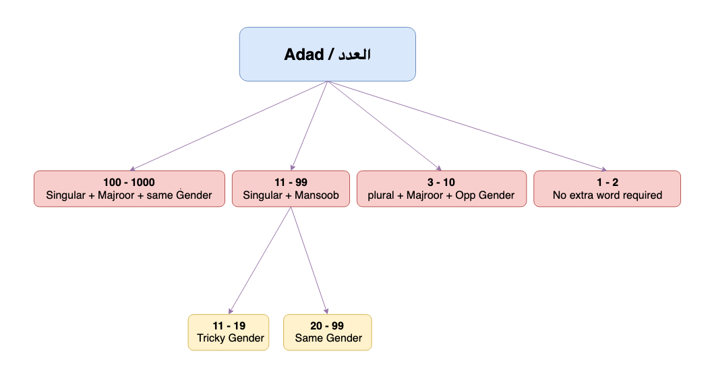

**Adad**{: .firstword} or **العدد**{: .firstword} is a very fascinating concept of Arabic grammar in which we learn how Arabs used to count things.

 

**Disclaimer**{: .exception} Arabic counting gets very tricky. So have patience and do a lot of Istigfaar in the meantime :)

 

Lets divide the numbers into 4 cases and begin with 

 

**Case 1**{: .heading1} **العدد of 1 and 2**  

| المفرد | اشتريت كتاباً |
|------------|----------|
| المثنى | اشترت كتابين  |

Where كتاباً itself means a single book and كتابين means two books. So we don't need any extra word to describe its count.

 

**Case 2**{: .heading1} **العدد from 3 to 10**  
*Rule* It is plural and Majroor (i.e. تمييزه جمع مجرور) with opposite Gender (i.e. العدد يخالف المعدود)  
Example: 
- اشتريت ثلاثة كتبٍ
> **كتبٍ**{: .arabic .irab}
مضاف إليه مجرور وعلامة جره الكسرة  
OR  
تمييز مجرور وعلامة جره الكسرة

 

where ثلاثة is عدد and كتب is معدود

 

Also اشتريت ثلاثة كتب and اشتريت ثلاثة **من**{: .bg-yellow} الكتبِ means same thing. We can use both formats.

 

More examples:
- رأيت ثلاثةَ رجال
- رأيت ثلاثَ نساء
- رأيت عشرة رجال
- رأيت عشر نساء

 

**Case 3**{: .heading1} **العدد from 11 to 99**  
*Rule* It is Singular and Mansoob  (i.e. تمييزه مفرد منصوب)  
Example: اشتريت أحد عشر قلماً
> **قلماً**{: .arabic .irab}
تمييز منصوب وعلامة نصبه الفتحة

**Case 3a**{: .heading1} **Gender from 11 to 19 is يوافق المعدود**  
- جاء ثلاث**ةَ**{: .bg-yellow} عشرَ رجلاً
  - Gender of عشرَ is same as رجلاً and ثلاثةَ is opposite of رجلاً
- رأيت ثلاث عشر**ة**{: .bg-yellow} امرأ**ة**{: .bg-yellow}
- رأيت أحد عشر رجلاً

**Case 3b**{: .heading1} **Gender from 20 to 99 doesn't change (لا تتغير)**
- رأيت ثلاثاً وعشرين امرأةً
- رأيت ثلاثةَ وعشرين رجلاً

 

**Case 4**{: .heading1} **العدد from 100 to 1000**  
*Rule* It is Singular and Majroor (i.e. تمييزه مفرد مجرور) and doesn't change (لا تتغير)  
Example: اشتريت مائة كتابٍ
> **كتبٍ**{: .arabic .irab}
مضاف إليه مجرور وعلامة جره الكسرة  
OR  
تمييز مجرور وعلامة جره الكسرة  

 

{:title="Four Cases of Adad"}

 

## Points to Remember
- Look at singular المعدود whether it is masculine or feminine not its plural form i.e. (ننظر إلى مفرد المعدود هل هو مذكر أو مؤنث ولا ننظر إلى الجمع)
  - Example in  سخرها عليهم سبع **ليال**{: .bg-yellow} وثمانية **أيام**{: .bg-yellow} حسوماً we will consider ليلة (feminine) and يوم (masculine) **NOT** ليال (masculine) and أيام (feminine)
- 1985
  - 5 = آحاد
  - 8 =  عشرات
  - 9 = مئات
  - 1 = آلاف
- 1440
  - Right to Left: سنة ألف و أربعمائة وأربعين
  - Left to Right: سنة أربعين وأربعمائة و ألف

## **العدد المركب**{: .arabic}
It is from 11 to 19 (أحد عشر  - تسع عشر)  
Both the parts are Mabni (مبني على فتح الجزئين) i.e. أحد and عشر both mabni.  
For Example:
  - جاء أحدَ عشرَ رجلاً
    - أحدَ عشرَ is Fai'l 
  - رأيت أحدَ عشرَ رجلاً
    - أحدَ عشرَ is Mafool Bihi
  - ذهبت إلى أحدَ عشرَ رجلاً

 

Irab of جاء أحدَ عشرَ رجلاً
> **أحدَ عشرَ**{: .arabic .irab}
عدد مبني على فتح الجزئين في محل رفع فاعل

 

**Exception**{: .exception} with 12 i.e. اثنا عشر where اثنا is Mo'rab and عشر is Mabni (الجزء الأول معرب والجزء الثاني مبني على الفتح)
  - جاء اثنا عشرَ رجلاً
  - رأيت اثني عشرَ رجلاً
  - ذهبت إلى اثني عشرَ رجلاً

 

Irab of جاء اثنا عشرَ رجلاً
> **اثنا عشر**{: .arabic .irab}
اثنا فاعل مرفوع وعلامة رفعه الألف نيابة عن الضمة
عشر مبني على الفتح

 

That's it folks !!!  
That's how Adad in Arabic works

## Reference
- [Qutoof Academy](https://www.qutoofacademy.com/){:target="_blank" rel="nofollow noopener"}