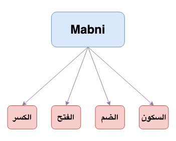

**Mabni**{: .firstword} Or **مبني**{: .firstword} are الكلمات in Arabic grammar whose endings are fixed.

 

The ending of Mabni can be,
- Sukoon (السكون)
  - e.g., من Or أجل (meaning of نعم) Or كم Or هل
- Damma (الضم)
  - e.g., قبلُ Or بعدُ Or نحنُ Or قطُّ
- Fatha (الفتح)
  - e.g. اينَ Or أحدَ عشرَ Or شَتَّانَ (meaning افترق e.g. شَتَّانَ ما بين الهدى والضلال)
- Kasra (الكسر)
  - e.g. أمسِ (meaning اليوم السابق) Or الأمسِ (meaning الماضي/past)

{:title="4 Mabni"}

 

But, the question is

## How to identify Mabniyaat (المبنيات)
 There are general guidelines to identify the Mabniyaat, which are as follows,
- All harf are Mabni 
  - الحروف كلها مبنية وليس لها محل من الإعراب
- Fai'l Amr is Mabni
  - فعل الأمر دائما مبني
- Fai'l Madhi is Mabni
  - الفعل الماضي دائماً مبني
- Fai'l Mudhari is mabni when added with ن of Tawkeed or ن of Niswa
  - الفعل المضارع مبني إذا اتصلت به نون التوكيد أو نون النسوة

 

Usually, Isms are Mo'rab (الأصل في الأسماء الإعراب), but there are cases when Isms are Mabni which are as follows
- الضمائر are Mabni
  - It has محل من الإعراب
- أسماء الإشارة are Mabni
- الأسماء الموصولة are Mabni
- أسماء الأفعال are Mabni
  - It doesn't have محل من الإعراب
  - Example آمين Or حيَّ (which is  اسم فعل أمر) Or شَتَّان (which is اسم فعل ماض) Or أُفٍّ (which is اسم فعل مضارع)
- أسماء الاستفهام are Mabni
- أسماء الشرط are Mabni
- الأسماء المركبة are Mabni
  - Example: أحد عشر
- اسم لا is Mabni (في بعض المواضع)
  - Example: لا أحدَ في البيت
- المنادى is Mabni (في بعض المواضع)
  - Example: يا زيدُ
- أسماء متفرقة
  - Example: جَيْرِ (meaning نعم) Or حذامِ (name of women) Or بعض الظروف, e.g. إذْ

 

I hope now you have enough pointers to identify Mabni in an Arabic sentence.

 

Happy Learning :)

## Reference
- [Qutoof Academy](https://www.qutoofacademy.com/){:target="_blank" rel="nofollow noopener"}